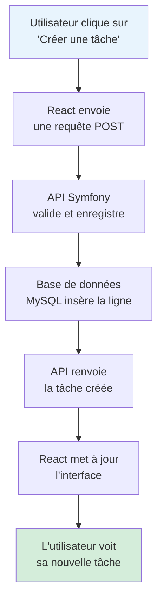
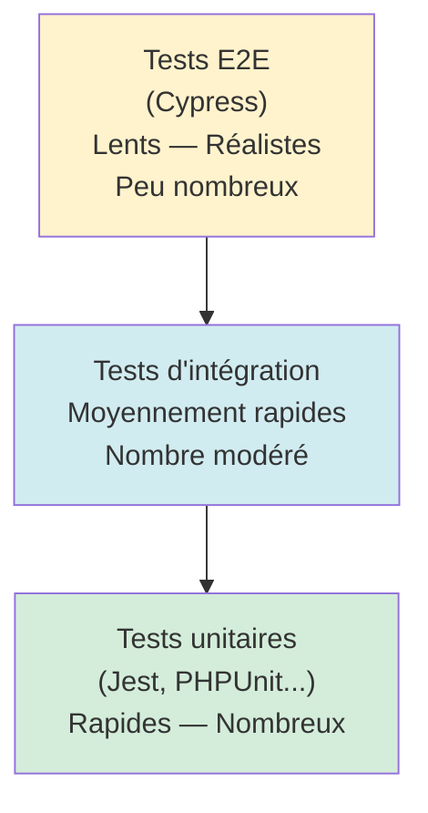
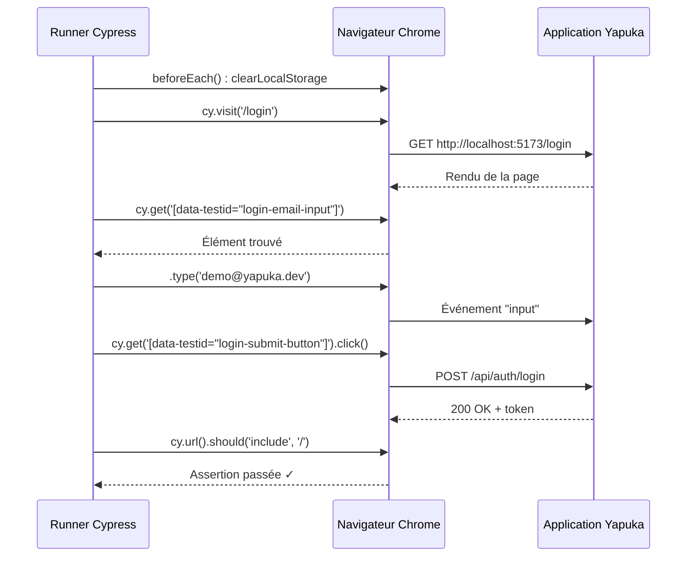
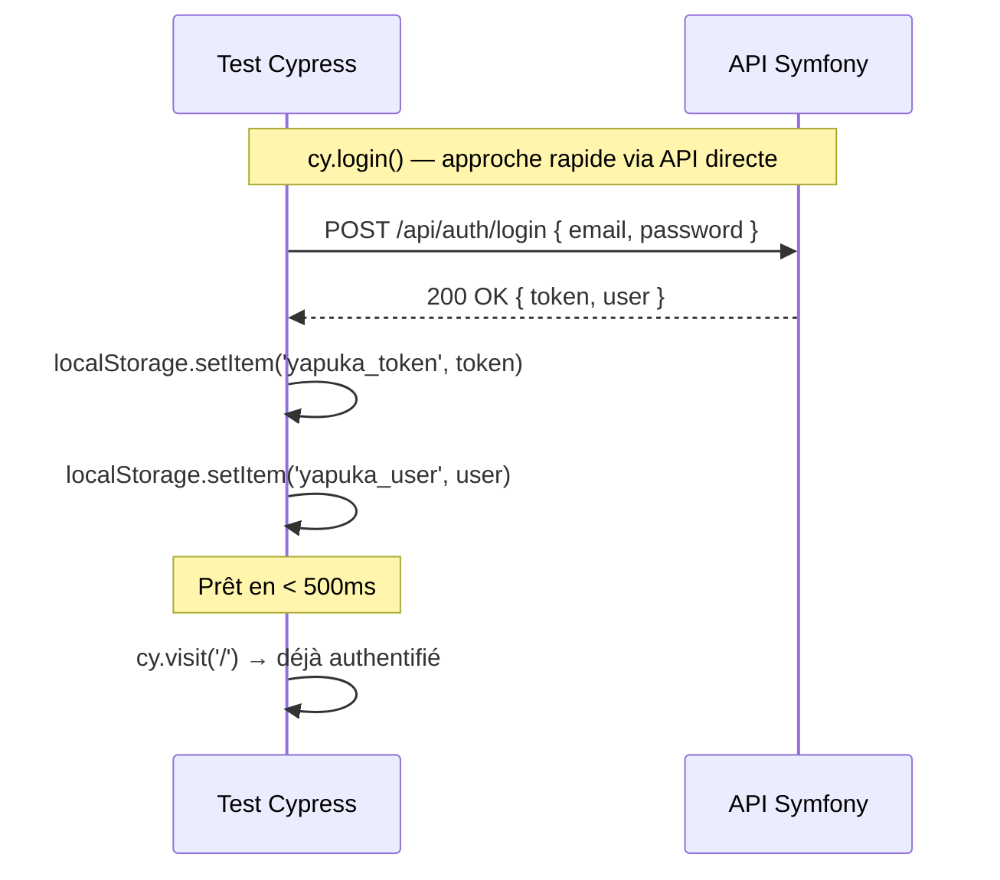
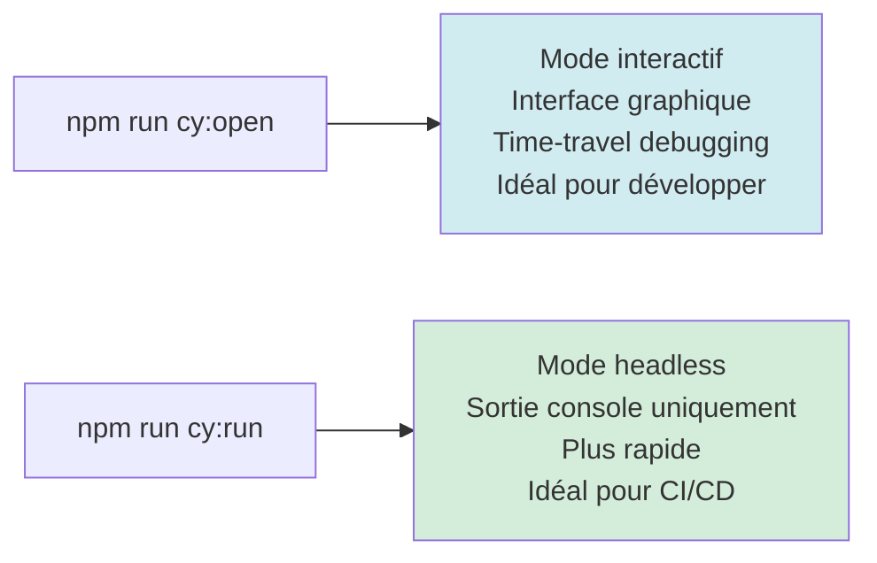
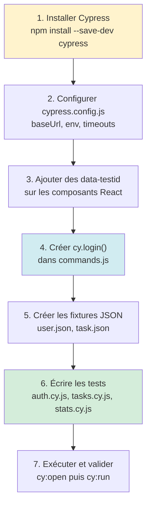

# 1. Tests End-to-End avec Cypress

## Introduction

### Le problème des tests "en silo"

Imaginez que vous construisez une voiture. L'ingénieur moteur teste le moteur :
il démarre, il tourne, parfait. L'ingénieur boîte de vitesses teste la boîte :
les rapports passent, parfait. L'ingénieur frein teste les freins : ils bloquent
bien, parfait.

Le jour de l'inspection finale, on monte tout... et la voiture ne démarre pas.
La boîte de vitesses envoie un signal que le moteur n'attendait pas. Chaque
pièce est bonne, mais l'ensemble est cassé.

C'est exactement le problème que résolvent les **tests End-to-End** (E2E).

Les tests unitaires vérifient qu'une fonction produit le bon résultat. Les tests
d'intégration vérifient que deux modules communiquent correctement. Mais aucun
des deux ne répond à la vraie question : **"Est-ce que l'utilisateur peut
accomplir sa tâche ?"**

Un test E2E pilote un vrai navigateur, comme le ferait un utilisateur humain. Il
clique, tape du texte, soumet des formulaires, et vérifie que l'application
réagit correctement de bout en bout — du clic dans le navigateur jusqu'à la base
de données, et retour.



Un test unitaire n'aurait testé qu'une seule flèche de ce schéma. Un test E2E
vérifie que la chaîne complète fonctionne.

### La pyramide des tests

En développement professionnel, on parle souvent de "pyramide des tests" :
beaucoup de tests unitaires (rapides, bon marché), moins de tests d'intégration,
et une couche de tests E2E au sommet (plus lents, mais qui couvrent les parcours
critiques).



Dans ce lab, vous vous concentrez sur le sommet de la pyramide : les parcours
utilisateurs critiques de l'application Yapuka.

---

## Cypress : le copilote de votre navigateur

### Ce que Cypress fait concrètement

Cypress n'est pas un simple script qui envoie des requêtes HTTP. C'est un outil
qui **prend le contrôle d'un navigateur Chrome** (ou Firefox, Edge) et l'utilise
exactement comme le ferait un utilisateur. Il voit ce que l'utilisateur voit. Il
attend que les éléments soient visibles avant de cliquer. Il peut même faire
"rembobiner le temps" pour vous montrer l'état de la page à chaque étape du
test.

Pensez à Cypress comme à un **stagiaire très patient** assis devant votre
application : vous lui donnez un script précis à exécuter, il l'exécute à la
lettre, prend des captures d'écran à chaque étape, et vous dit exactement ce qui
n'a pas fonctionné.

### Architecture d'un projet Cypress

Après installation, Cypress crée cette structure dans votre dossier `front/` :

```
front/
├── cypress/
│   ├── e2e/              ← Vos fichiers de tests (.cy.js)
│   ├── fixtures/         ← Données de test réutilisables (JSON)
│   └── support/
│       ├── commands.js   ← Vos commandes personnalisées
│       └── e2e.js        ← Fichier de configuration globale
└── cypress.config.js     ← Configuration principale
```

Chaque fichier dans `e2e/` est une **suite de tests**. Chaque suite contient
des **scénarios**. Chaque scénario simule un parcours utilisateur.

---

## Les concepts clés avant de commencer

### 1. La sélection d'éléments avec `data-testid`

Comment Cypress sait-il où cliquer sur la page ? En ciblant des éléments HTML.
Il peut utiliser des classes CSS, des sélecteurs... mais ces approches sont
fragiles : si vous renommez une classe Tailwind, votre test casse.

La bonne pratique est d'ajouter un attribut **`data-testid`** dédié aux tests.
C'est une convention : l'attribut n'a aucun effet visuel, il sert uniquement de
point d'ancrage stable pour les tests.

```jsx
{/* Dans votre composant React */}
<button
  data-testid="task-delete-button"
  onClick={handleDelete}
>
  Supprimer
</button>
```

```js
// Dans votre test Cypress
cy.get('[data-testid="task-delete-button"]').click();
```

Quand plusieurs éléments similaires coexistent (plusieurs cartes de tâches,
par exemple), on intègre un identifiant unique :

```jsx
{/* Pour la tâche avec l'id 42 */}
<button data-testid={`task-delete-${task.id}`}>Supprimer</button>
```

```js
// Ciblage précis de la tâche 42
cy.get('[data-testid="task-delete-42"]').click();
```

### 2. Les commandes Cypress essentielles

Cypress s'utilise comme une suite de phrases en anglais lisibles, chaînées les
unes aux autres. Voici le vocabulaire du lab :

| Commande                    | Ce qu'elle fait                       | Exemple                                       |
|-----------------------------|---------------------------------------|-----------------------------------------------|
| `cy.visit(url)`             | Ouvre une URL dans le navigateur      | `cy.visit('/login')`                          |
| `cy.get(selector)`          | Trouve un élément dans la page        | `cy.get('[data-testid="login-email-input"]')` |
| `.type(texte)`              | Tape du texte dans un champ           | `.type('demo@yapuka.dev')`                    |
| `.click()`                  | Clique sur l'élément                  | `.click()`                                    |
| `.clear()`                  | Vide un champ de texte                | `.clear()`                                    |
| `.select(valeur)`           | Choisit une option dans un `<select>` | `.select('high')`                             |
| `.should(assertion)`        | Vérifie une condition                 | `.should('be.visible')`                       |
| `.should('contain', texte)` | Vérifie le contenu textuel            | `.should('contain', 'Bonjour')`               |
| `.should('not.exist')`      | Vérifie qu'un élément a disparu       | `.should('not.exist')`                        |
| `cy.url()`                  | Renvoie l'URL courante                | `cy.url().should('include', '/login')`        |
| `cy.contains(texte)`        | Trouve un élément contenant ce texte  | `cy.contains('Tableau de bord')`              |

Ces commandes sont **automatiquement asynchrones et patientes** : Cypress attend
jusqu'à 4 secondes (configurable) qu'un élément apparaisse avant de déclarer
l'échec. Vous n'avez pas besoin d'écrire des `setTimeout`.

### 3. La structure d'un fichier de tests

Un fichier de test Cypress s'organise en blocs imbriqués :

```js
// cypress/e2e/auth.cy.js

// describe() regroupe les tests d'une fonctionnalité
describe('Authentification', () => {

    // beforeEach() s'exécute avant chaque test du groupe
    beforeEach(() => {
        cy.clearLocalStorage();
    });

    // it() décrit un scénario précis
    it('affiche le formulaire de connexion', () => {
        cy.visit('/login');
        cy.get('[data-testid="login-email-input"]').should('exist');
        cy.get('[data-testid="login-submit-button"]').should('exist');
    });

    it('redirige vers le dashboard après connexion', () => {
        cy.visit('/login');
        cy.get('[data-testid="login-email-input"]').type('demo@yapuka.dev');
        cy.get('[data-testid="login-password-input"]').type('password');
        cy.get('[data-testid="login-submit-button"]').click();
        cy.url().should('include', '/');
    });
});
```

Le flux d'exécution pour chaque `it()` est le suivant :



### 4. Les fixtures : des données de test centralisées

Imaginez que vous testez un formulaire d'inscription. Vous avez besoin d'un
email, d'un mot de passe, d'un nom d'utilisateur. Si vous les écrivez en dur
dans chaque test, un changement de compte de démo vous oblige à modifier dix
fichiers.

Les **fixtures** sont des fichiers JSON dans `cypress/fixtures/`. Vous y
centralisez vos données de test, et vous les chargez dans vos tests avec
`cy.fixture()` :

```json
// cypress/fixtures/user.json
{
  "email": "demo@yapuka.dev",
  "password": "password"
}
```

```js
// Dans un test
it('se connecte avec les identifiants de démo', () => {
    cy.fixture('user').then((user) => {
        cy.get('[data-testid="login-email-input"]').type(user.email);
        cy.get('[data-testid="login-password-input"]').type(user.password);
    });
});
```

### 5. Les commandes personnalisées

Le login est nécessaire avant presque chaque test. Si vous passez par le
formulaire à chaque fois, chaque test prend plusieurs secondes inutilement — et
si l'interface de connexion change, tous vos tests cassent.

Cypress permet de créer des **commandes personnalisées** dans
`cypress/support/commands.js`. Ces commandes deviennent disponibles via `cy.`
dans tous vos fichiers de tests.

La bonne pratique est de se connecter **directement via l'API** (sans passer
par l'interface graphique), puis de stocker le token dans le `localStorage`
comme le ferait l'application elle-même :



Cette approche est bien plus rapide que de remplir le formulaire à chaque test.

### 6. Intercepter les requêtes réseau

Cypress peut espionner les appels réseau entre votre frontend React et votre
API Symfony. Cela sert à deux choses :

- **Vérifier** qu'une requête a bien été envoyée avec le bon status code
- **Capturer** la réponse (par exemple, l'`id` d'une ressource créée)

```js
// Déclarer l'interception AVANT l'action qui déclenche la requête
cy.intercept('POST', '**/api/tasks').as('createTask');

// Action déclenchante
cy.get('[data-testid="task-add-button"]').click();

// Attendre et inspecter la requête
cy.wait('@createTask').then((interception) => {
    expect(interception.response.statusCode).to.eq(201);
    const newTaskId = interception.response.body.id;
    // On peut maintenant cibler data-testid="task-delete-42"
});
```

Le `**` dans le pattern d'URL est un joker qui matche n'importe quel domaine
et port — pratique pour ne pas avoir à répéter `http://localhost:8080`.

---

## Configuration de Cypress

Le fichier `cypress.config.js` centralise les paramètres globaux. Pour ce lab,
les paramètres importants sont :

```js
module.exports = defineConfig({
    e2e: {
        // Evite de répéter l'URL complète dans chaque cy.visit()
        baseUrl: 'http://localhost:5173',

        // Taille de fenêtre cohérente entre les exécutions
        viewportWidth: 1280,
        viewportHeight: 720,

        // Temps d'attente max pour trouver un élément (ms)
        // À augmenter si votre API tourne dans Docker
        defaultCommandTimeout: 8000,

        // Variables accessibles via Cypress.env('clé')
        env: {
            apiUrl: 'http://localhost:8080',
            testUserEmail: 'demo@yapuka.dev',
            testUserPassword: 'password',
        },
    },
});
```

---

## Deux modes d'exécution

Cypress offre deux façons de lancer vos tests :



**Mode interactif** (`cy:open`) : vous voyez le navigateur s'ouvrir, les clics
s'effectuer en temps réel. Dans le panneau latéral, chaque commande est listée
et vous pouvez cliquer dessus pour voir exactement l'état de la page à cet
instant précis — c'est le "time-travel debugging".

**Mode headless** (`cy:run`) : aucune fenêtre ne s'ouvre, tout s'exécute en
arrière-plan. La sortie console affiche un récapitulatif des tests passés et
échoués. C'est ce mode que les pipelines CI/CD utilisent.

---

## Ce dont vous avez besoin pour ce lab

Avant de commencer, voici la liste de ce que le lab va vous demander de faire,
dans l'ordre :



Les deux étapes les plus délicates sont :

- **L'ajout des `data-testid`** : il faut annoter précisément les bons éléments
  dans chaque composant React. Prenez le temps de lire le code avant de placer
  vos attributs.

- **Le CRUD des tâches** : les scénarios de création, modification et suppression
  sont interdépendants. La tâche créée au scénario 2 est modifiée au scénario 3,
  puis supprimée au scénario 5. Vous devrez capturer l'`id` de la tâche créée
  via `cy.intercept()` pour pouvoir cibler les bons `data-testid` dans les
  scénarios suivants.

---

## Prérequis

Avant de commencer le lab, vérifiez que :

- L'application Yapuka tourne via `docker compose up -d`
- Vous pouvez vous connecter sur `http://localhost:5173` avec
  `demo@yapuka.dev` / `password`
- Les fixtures Symfony sont chargées (la liste des tâches n'est pas vide)
- Node.js et npm sont disponibles dans le dossier `front/`