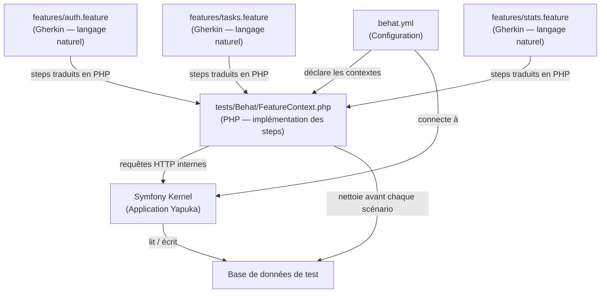
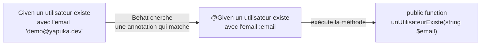
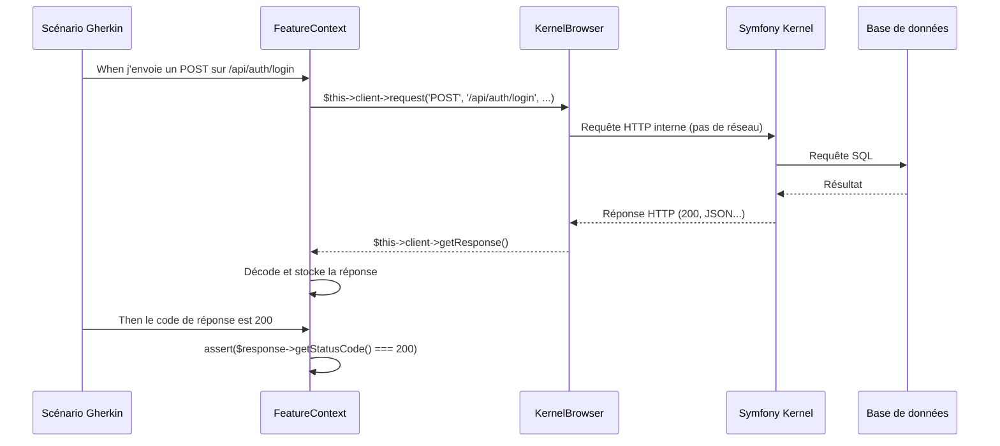
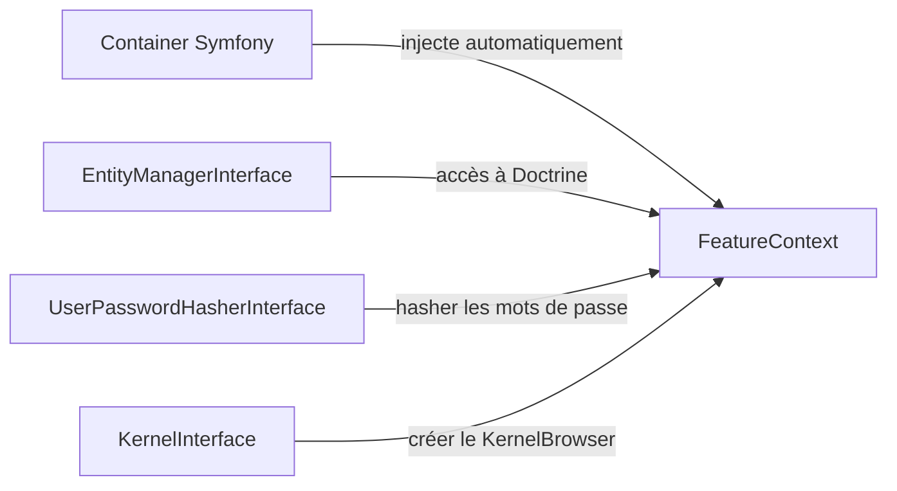
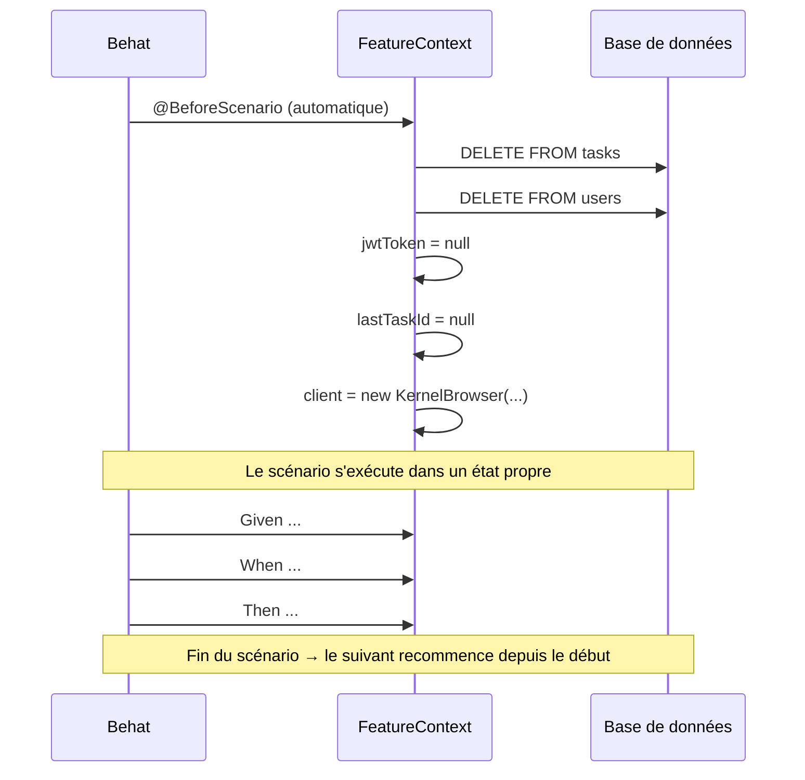
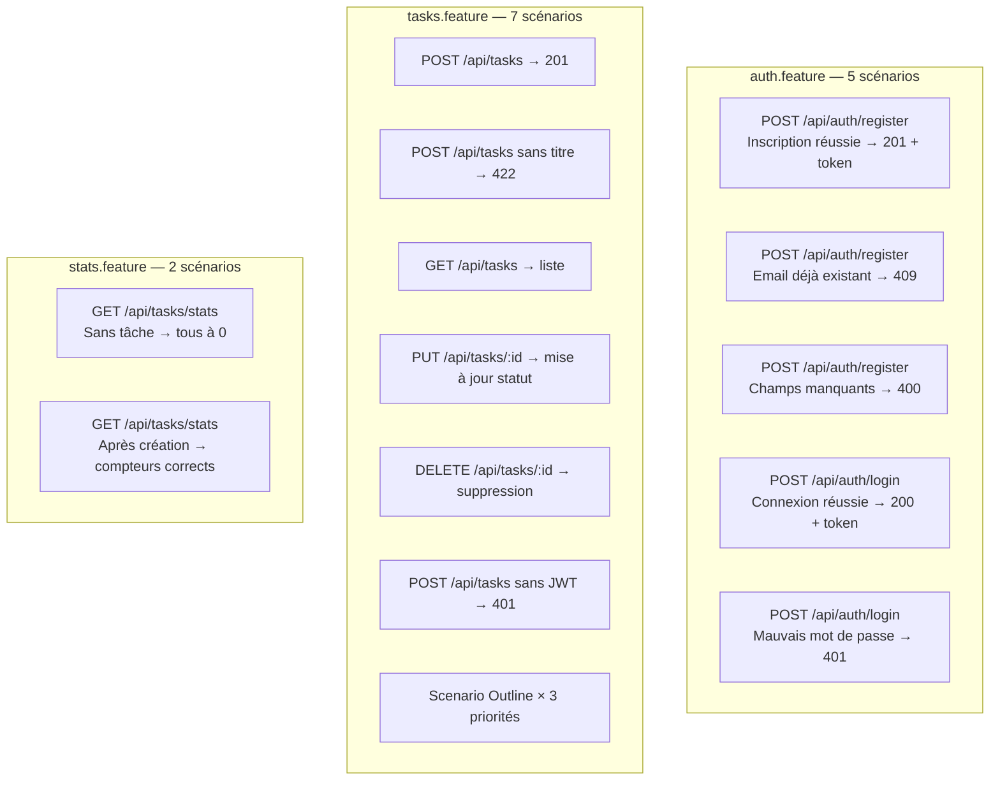
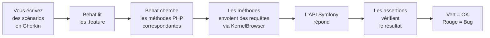

# 2. Tests BDD avec Behat

## Le problème que résout ce lab

Imaginez que vous livrez une fonctionnalité à votre client.
Il la teste, et revient vers vous : "Non, ce n'est pas ce que
j'avais demandé." Vous relisez sa demande initiale, un email
vague avec trois lignes. Tout le monde avait compris quelque chose
de différent.

Ce scénario se répète des milliers de fois chaque jour dans les
équipes de développement. La cause est toujours la même : la
spécification et le test vivent dans deux mondes séparés.
L'un est rédigé en langage humain, l'autre en code que seul
le développeur peut lire.

Le **Behavior-Driven Development** (BDD) est une réponse directe
à ce problème. L'idée est simple : écrire les tests dans un langage
que tout le monde comprend — le product owner, le testeur, et
le développeur — avant même d'écrire le code.

Dans ce lab, vous allez utiliser **Behat**, le framework BDD de
référence en PHP, pour tester l'API de gestion des tâches de
l'application Yapuka.

---

## L'analogie du scénario de cinéma

Pensez à un **scénario de film**. Avant de tourner la moindre
scène, le réalisateur et les acteurs lisent un document précis :
qui fait quoi, dans quel contexte, et ce qui doit se passer.
Ce document est compris par le directeur artistique comme par le
chef opérateur.

Behat fonctionne exactement comme ça. Vous rédigez d'abord des
**scénarios** en langage naturel (le scénario du film), puis Behat
les exécute automatiquement en les reliant à du code PHP (les
acteurs qui jouent les scènes).

```
Scénario de film          Scénario Behat
──────────────────        ──────────────────────────────────────
Contexte initial    →     Given un utilisateur existe
Action du personnage →    When il envoie ses identifiants
Résultat attendu    →     Then il reçoit un token JWT
```

---

## Le langage Gherkin : parler à la machine en français

Behat utilise le langage **Gherkin** pour écrire les scénarios.
Ce langage repose sur trois mots-clés fondamentaux :

```gherkin
Feature: Connexion à l'application

  Scenario: Connexion réussie
    Given un utilisateur existe avec l'email "demo@yapuka.dev"
    When  il envoie ses identifiants corrects
    Then  il reçoit un token JWT dans la réponse
```

Chaque ligne commence par un mot-clé qui joue un rôle précis :

| Mot-clé | Rôle | Analogie |
|---|---|---|
| `Feature` | Nom de la fonctionnalité | Titre du chapitre |
| `Scenario` | Un cas de test précis | Une histoire complète |
| `Given` | L'état du monde au départ | "Il était une fois..." |
| `When` | L'action déclenchante | "Soudain..." |
| `Then` | Ce qu'on vérifie | "Et ils vécurent..." |
| `And` | Continuation du step précédent | "De plus..." |
| `Background` | Steps répétés avant chaque scénario | Intro commune à tous |

### Le Scenario Outline : tester plusieurs cas d'un coup

Quand vous voulez tester la même logique avec des données
différentes (par exemple, les priorités `low`, `medium`, `high`),
vous utilisez un `Scenario Outline` avec un tableau d'exemples :

```gherkin
Scenario Outline: Créer une tâche avec différentes priorités
  When je crée une tâche avec la priorité "<priority>"
  Then le code de réponse est 201

  Examples:
    | priority |
    | low      |
    | medium   |
    | high     |
```

Behat va exécuter ce scénario trois fois, en substituant
`<priority>` par chaque valeur du tableau.

---

## L'architecture : comment tout s'assemble

Voici comment les fichiers du lab s'articulent entre eux :



Les fichiers `.feature` sont le **point de départ** : vous y
décrivez le comportement attendu. Le `FeatureContext.php` est le
**traducteur** : il sait comment exécuter chaque phrase Gherkin.
Le `behat.yml` est le **chef d'orchestre** : il relie tout.

---

## Le FeatureContext : le traducteur PHP

Chaque phrase Gherkin doit correspondre à une méthode PHP.
Cette correspondance se fait via des **annotations** PHP.

Voici comment une phrase Gherkin est reliée à du code PHP :



En PHP, ça ressemble à ceci :

```php
/**
 * @Given un utilisateur existe avec l'email :email et le mot de passe :password
 */
public function unUtilisateurExiste(
    string $email,
    string $password
): void {
    // Créer un User en base de données
    $user = new User();
    $user->setEmail($email);
    // ...
    $this->entityManager->persist($user);
    $this->entityManager->flush();
}
```

Les `:email` et `:password` dans l'annotation sont des
**paramètres** : Behat extrait automatiquement les valeurs
du texte Gherkin et les passe à la méthode PHP.

---

## Le KernelBrowser : simuler des requêtes HTTP sans réseau

Pour tester l'API, vous n'allez pas ouvrir un vrai navigateur
ni faire de vraies requêtes réseau. Vous utilisez le
**KernelBrowser** de Symfony : un client HTTP interne qui
parle directement au kernel Symfony, sans passer par TCP/IP.

C'est comme la différence entre appeler un collègue assis à
côté de vous (KernelBrowser) et lui envoyer un courrier postal
(vraie requête réseau). Le résultat est le même, mais c'est
infiniment plus rapide et fiable pour les tests.



---

## Les extensions : Symfony et Behatch

Behat seul ne sait pas ce qu'est un kernel Symfony. Deux
extensions comblent cette lacune.

### L'extension Symfony (FriendsOfBehat)

Elle permet à votre `FeatureContext` de recevoir des services
Symfony par **injection de dépendances**, exactement comme un
controller ou un service classique. C'est ce qui vous permet
d'utiliser `EntityManagerInterface` ou `UserPasswordHasherInterface`
directement dans votre contexte.



### L'extension Behatch

Elle fournit des contextes prêts à l'emploi avec des steps
courants pour les APIs REST et JSON :
`Behatch\Context\RestContext` et `Behatch\Context\JsonContext`.

> **Attention aux conflits** : si vous définissez un step dans
> votre `FeatureContext` avec le même texte qu'un step de
> Behatch, Behat ne saura pas lequel choisir et affichera
> une erreur `Ambiguous`. Dans ce cas, supprimez le doublon
> dans votre contexte ou retirez le contexte Behatch.

---

## Le cycle de vie d'un scénario

Avant chaque scénario, votre `FeatureContext` doit repartir
d'un état propre. Le hook `@BeforeScenario` s'exécute
automatiquement avant chaque scénario pour nettoyer la base
et réinitialiser l'état interne.



Cela garantit que les scénarios sont **indépendants** les uns
des autres : l'ordre d'exécution n'a aucune importance.

---

## La configuration behat.yml

Le fichier `behat.yml` est le point central de configuration.
Il déclare quels contextes utiliser et comment se connecter
à l'application Symfony.

```yaml
default:
  suites:
    default:
      contexts:
        # Votre contexte personnalisé
        - App\Tests\Behat\FeatureContext
        # Contextes Behatch (steps REST et JSON prêts à l'emploi)
        - Behatch\Context\RestContext
        - Behatch\Context\JsonContext

  extensions:
    # Connexion à Symfony en environnement de test
    FriendsOfBehat\SymfonyExtension:
      kernel:
        class: App\Kernel
        environment: test
        debug: true
    # Activation de Behatch
    Behatch\Extension: ~
```

> **Pourquoi `environment: test` ?** Symfony charge une
> configuration différente selon l'environnement. En mode
> `test`, il utilise une base de données dédiée (définie dans
> `.env.test`) et désactive certains comportements comme
> le cache, pour garantir des tests fiables et reproductibles.

---

## La structure des fichiers du projet

Voici l'arborescence que vous allez construire dans ce lab :

```
api/
├── features/
│   ├── auth.feature         ← Scénarios d'authentification
│   ├── tasks.feature        ← Scénarios CRUD des tâches
│   └── stats.feature        ← Scénarios de statistiques
├── tests/
│   └── Behat/
│       └── FeatureContext.php  ← Tous vos steps PHP
└── behat.yml                   ← Configuration de Behat
```

---

## Ce que Behat vérifie dans ce lab

L'API Yapuka expose trois groupes d'endpoints. Voici ce que
vos scénarios vont couvrir :



---

## Les étapes clés à retenir

Avant de vous lancer dans le lab, voici les points essentiels
à garder en tête :

**1. Gherkin → PHP via les annotations**
Chaque phrase `Given`/`When`/`Then` doit avoir une méthode PHP
correspondante dans `FeatureContext`, décorée de l'annotation
qui correspond exactement au texte.

**2. L'état se transmet entre les steps**
Dans un scénario, les steps s'exécutent en séquence et partagent
l'état de la classe (`$this->jwtToken`, `$this->lastTaskId`,
`$this->responseData`). Un step `Given` peut créer un token
que le step `When` utilisera ensuite.

**3. Chaque scénario repart de zéro**
Le hook `@BeforeScenario` vide la base et réinitialise l'état.
Ne comptez jamais sur des données créées par un scénario précédent.

**4. Le header d'authentification s'écrit `HTTP_AUTHORIZATION`**
Symfony attend `HTTP_AUTHORIZATION` (pas `Authorization`) quand
on utilise le KernelBrowser. C'est un piège classique.

**5. Générer les squelettes de steps**
La commande `vendor/bin/behat --dry-run --append-snippets`
analyse vos fichiers `.feature` et génère automatiquement les
signatures de méthodes PHP à implémenter. C'est votre point
de départ pour la partie 3.

---

## Résumé visuel



Vous êtes maintenant prêt à attaquer le lab. Bonne chance !