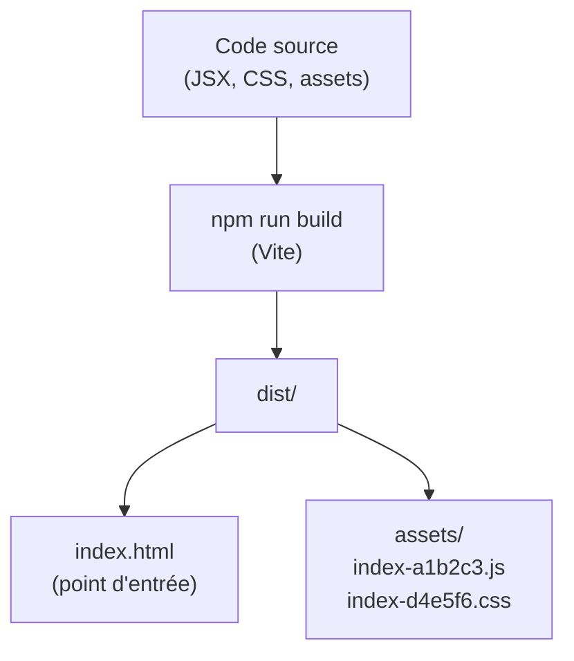
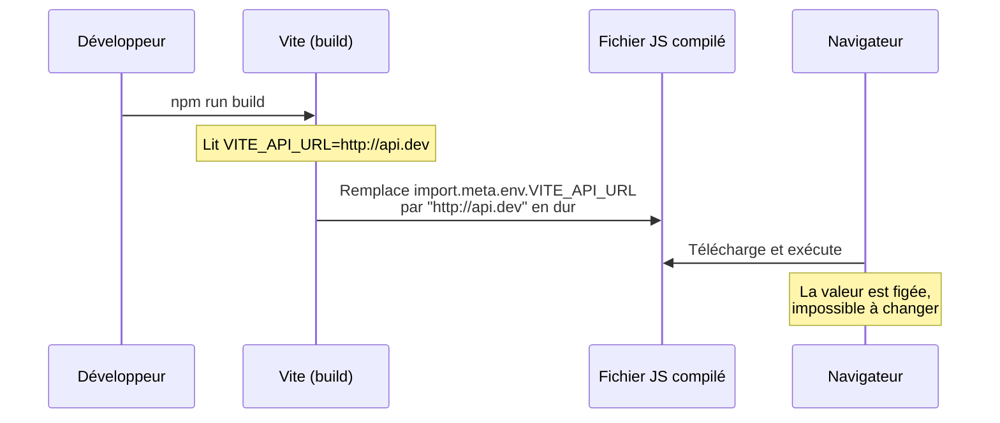
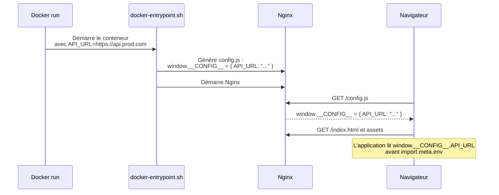
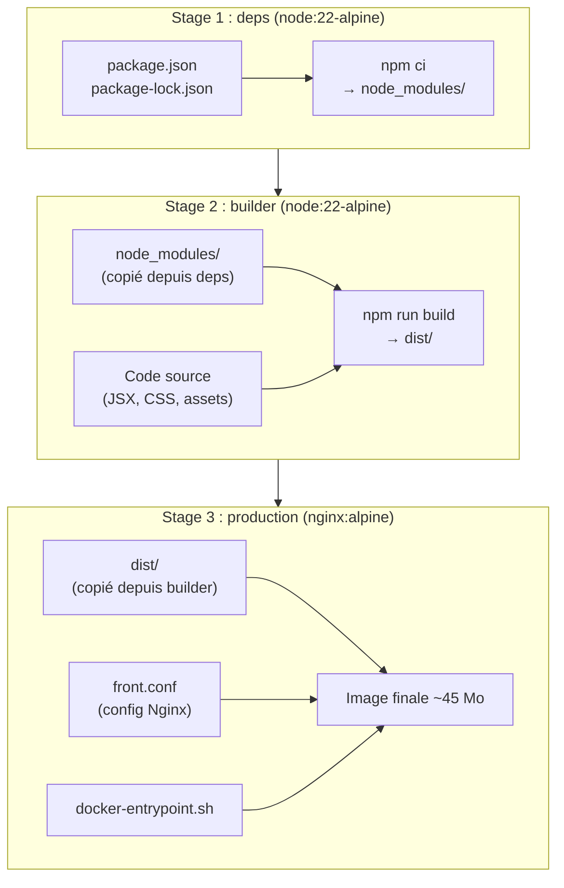
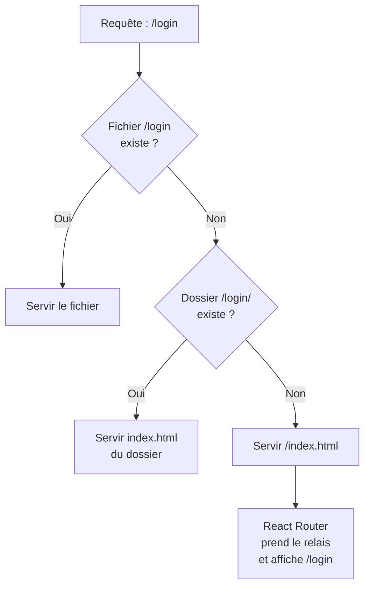
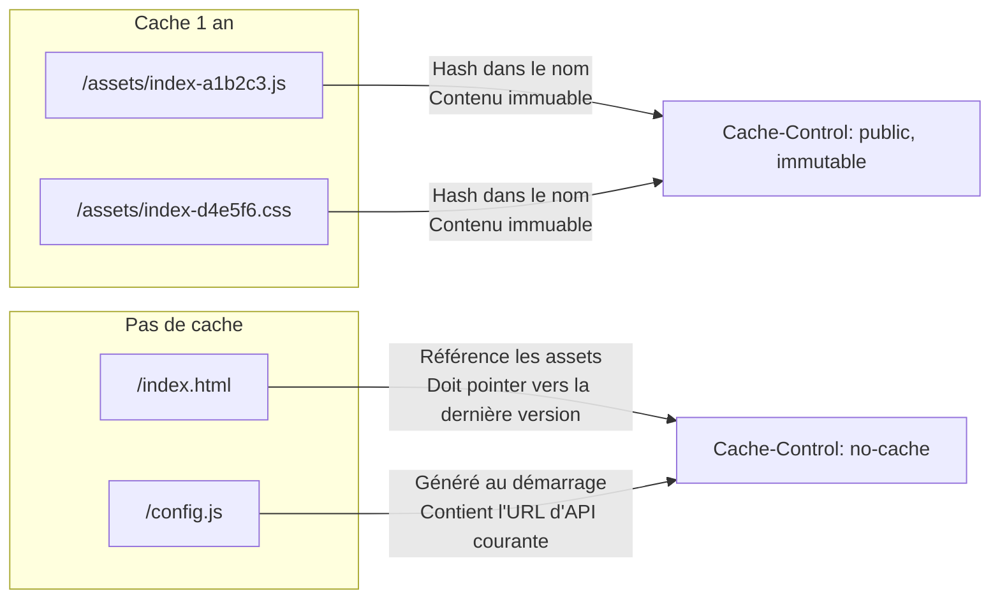
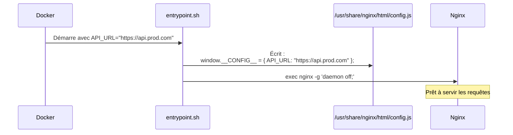
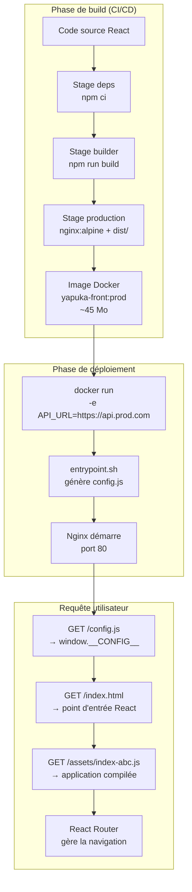

# 4. Dockerisation production d'un frontend React

## De l'atelier au magasin : comprendre les deux modes d'une SPA

Imaginez une boulangerie artisanale. En coulisses, le boulanger dispose
d'un laboratoire complet : fours, pétrin, balance de précision, et tout
l'équipement pour expérimenter de nouvelles recettes. C'est bruyant,
encombrant, et ça consomme beaucoup d'énergie. Mais en vitrine, il
n'expose que le résultat final : des pains et des viennoiseries, prêts
à être consommés.

Une application React fonctionne exactement de cette manière.

- **En développement**, Vite est votre laboratoire : serveur local,
  rechargement automatique à chaque modification (Hot Module
  Replacement), sourcemaps, messages d'erreur détaillés. C'est lourd
  (~400 Mo d'outils), mais puissant pour travailler.

- **En production**, seul le résultat compte : un dossier `dist/`
  contenant quelques fichiers HTML, CSS et JavaScript compilés, qui
  tiennent en quelques centaines de kilo-octets. Node.js n'est plus
  nécessaire — n'importe quel serveur web peut les distribuer.

C'est cette distinction fondamentale qui rend possible une image Docker
de production très légère : environ 45 Mo au lieu de 400 Mo.

---

## Le processus de build Vite

Quand vous lancez `npm run build`, Vite exécute une transformation
complète de votre code source. Il résout toutes les dépendances,
compile le JSX en JavaScript standard, optimise et minifie le code,
puis génère un dossier `dist/` autonome.



Remarquez les noms des fichiers dans `assets/` : ils contiennent un
**hash** calculé à partir du contenu. Si vous modifiez une ligne de
code, le hash change et le nom du fichier change. Cela permet une
stratégie de cache très agressive : un navigateur peut conserver ces
fichiers en cache pendant un an, en sachant que si leur contenu change,
leur URL changera aussi.

`index.html`, lui, ne contient pas de hash. Il référence les autres
fichiers par leur nom exact. C'est lui qui doit toujours être servi
frais, sans cache.

---

## Le défi des variables d'environnement dans une SPA

Voici le piège classique, et l'une des difficultés centrales de ce lab.

Dans une application serveur (Node.js, PHP, Python), les variables
d'environnement sont lues au moment où le serveur démarre. Vous pouvez
les changer, redémarrer, et le comportement change. C'est souple.

Dans une SPA compilée par Vite, c'est différent. Imaginez un livre
imprimé : une fois sorti de l'imprimerie, vous ne pouvez plus changer
le texte. Les variables `VITE_*` sont lues par Vite **au moment du
build** et leur valeur est littéralement inscrite dans les fichiers
JavaScript générés. Après compilation, elles sont figées.



Cela pose un problème concret : si vous construisez votre image Docker
avec l'URL de votre API de développement, cette URL sera présente dans
le code de toutes vos instances, qu'elles tournent en staging ou en
production.

### La solution : l'injection runtime

Pour contourner cette contrainte, on utilise une astuce élégante : au
démarrage du conteneur, un script shell génère un fichier JavaScript
(`config.js`) qui expose les variables d'environnement Docker dans
l'objet global `window.__CONFIG__`. Ce fichier est chargé par le
navigateur avant tout le reste de l'application.



Résultat : **une seule image Docker**, utilisable dans tous les
environnements. L'URL de l'API change via une variable d'environnement
au moment du `docker run`, sans jamais reconstruire l'image.

---

## Le multi-stage build : ne livrer que ce qui est nécessaire

Construire une image Docker pour une SPA en production, c'est comme
préparer un déménagement : vous n'emportez pas votre table de cuisine
dans votre nouveau bureau. Vous ne gardez que ce dont vous avez besoin
à destination.

Le **multi-stage build** de Docker permet d'utiliser plusieurs images
intermédiaires dans un seul Dockerfile. Seule la dernière image est
conservée dans l'image finale.



Les stages `deps` et `builder` servent uniquement pendant la
construction. Leurs centaines de mégaoctets de `node_modules/` et
d'outils Node.js n'entrent jamais dans l'image finale. Seul le
dossier `dist/` compilé est transféré vers le stage Nginx.

### ARG vs ENV dans Docker

Lors du stage `builder`, Vite a besoin de lire la variable
`VITE_API_URL`. Docker distingue deux types de variables :

| Type  | Disponible pendant le build | Disponible au runtime | Visible dans `docker inspect` |
|-------|-----------------------------|-----------------------|-------------------------------|
| `ARG` | Oui                         | Non                   | Non                           |
| `ENV` | Oui                         | Oui                   | Oui                           |

Pour que Vite accède à la valeur, il faut passer par les deux :

```docker
ARG VITE_API_URL=""
ENV VITE_API_URL=$VITE_API_URL
```

La valeur par défaut vide (`""`) signifie que Vite utilisera une URL
relative, ce qui est le comportement souhaité quand l'API et le
frontend partagent le même domaine derrière un reverse proxy.

---

## Nginx comme serveur de fichiers statiques

Nginx est ici utilisé dans son rôle le plus simple : distribuer des
fichiers. Pas de PHP, pas de Node.js, pas de logique applicative. Il
reçoit une requête HTTP, cherche le fichier correspondant sur le
disque, et le renvoie. C'est extrêmement rapide et peu gourmand en
ressources.

Mais une SPA introduit une subtilité importante.

### Le problème du routage SPA

Quand un utilisateur navigue vers `https://monapp.com/login`, il attend
de voir la page de connexion. React Router gère cette URL côté client.
Mais si l'utilisateur tape directement cette URL dans la barre
d'adresse, c'est Nginx qui reçoit la requête en premier, avant que
JavaScript ne soit chargé.

Nginx cherche alors un fichier `/login` sur le disque. Ce fichier
n'existe pas — seul `index.html` existe. Sans configuration adaptée,
Nginx renverrait une erreur 404.

La directive `try_files` résout ce problème :

```nginx
location / {
    try_files $uri $uri/ /index.html;
}
```

Elle indique à Nginx d'essayer dans l'ordre :



Les fichiers statiques réels (JS, CSS, images) sont servis directement.
Toutes les autres URLs renvoient `index.html`, laissant React Router
décider quoi afficher.

### La stratégie de cache

La configuration Nginx distingue deux catégories de fichiers selon leur
politique de cache :



`config.js` est particulièrement important à ne pas cacher : il est
regénéré à chaque démarrage du conteneur avec les variables
d'environnement courantes. Un cache navigateur le rendrait obsolète.

---

## L'entrypoint Docker : le chef d'orchestre du démarrage

Le script `docker-entrypoint.sh` est exécuté à chaque démarrage du
conteneur, avant Nginx. C'est lui qui lit les variables d'environnement
Docker et génère le fichier `config.js` dans le dossier servi par Nginx.



L'instruction `exec` en dernière ligne est importante : elle remplace
le processus shell par le processus Nginx, de sorte que Nginx devienne
le processus principal (PID 1) du conteneur. C'est la convention
Docker pour une gestion correcte des signaux d'arrêt.

---

## Récapitulatif : la chaîne complète

Voici comment tous les éléments s'assemblent, de votre code source
jusqu'au navigateur de l'utilisateur :



Chaque étape a un rôle précis. Le lab vous guidera pour créer et
assembler ces pièces une à une. Bonne mise en pratique !