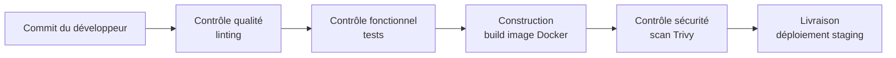
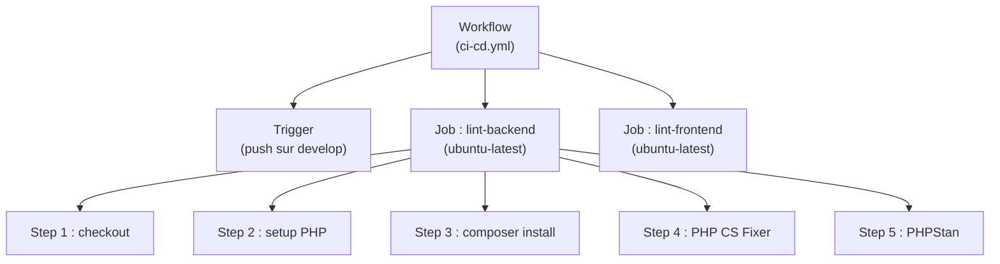
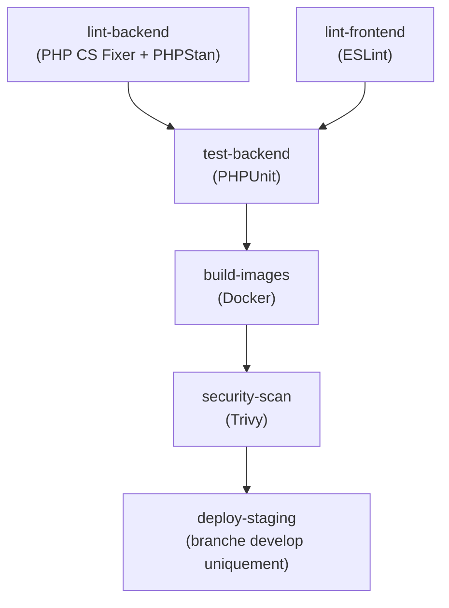
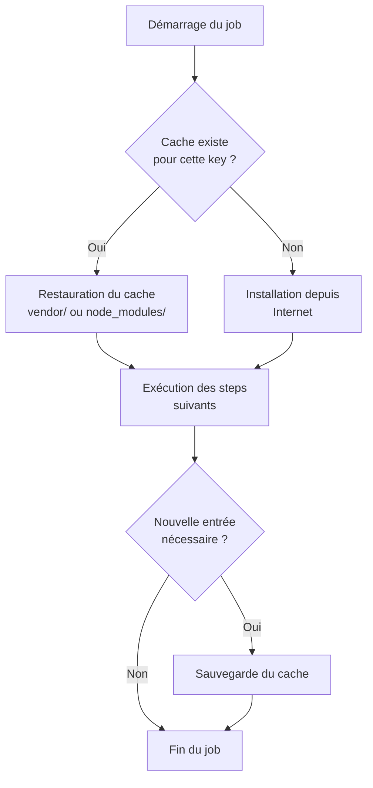
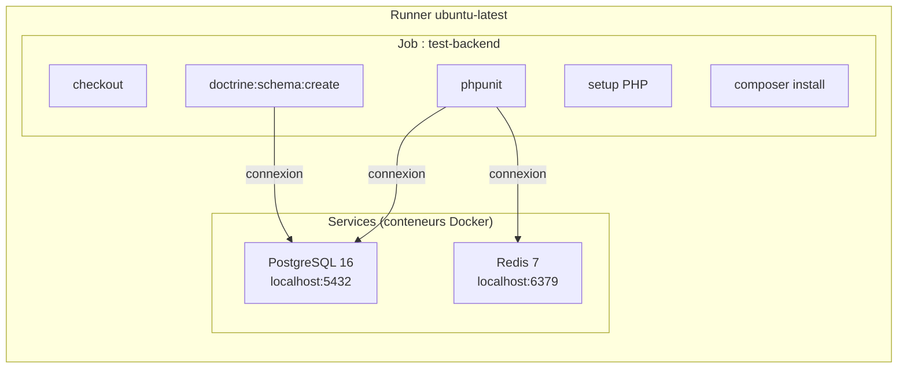
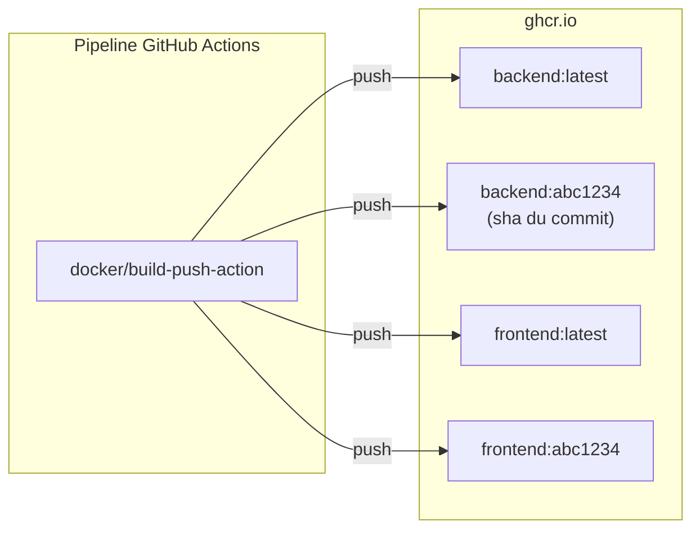
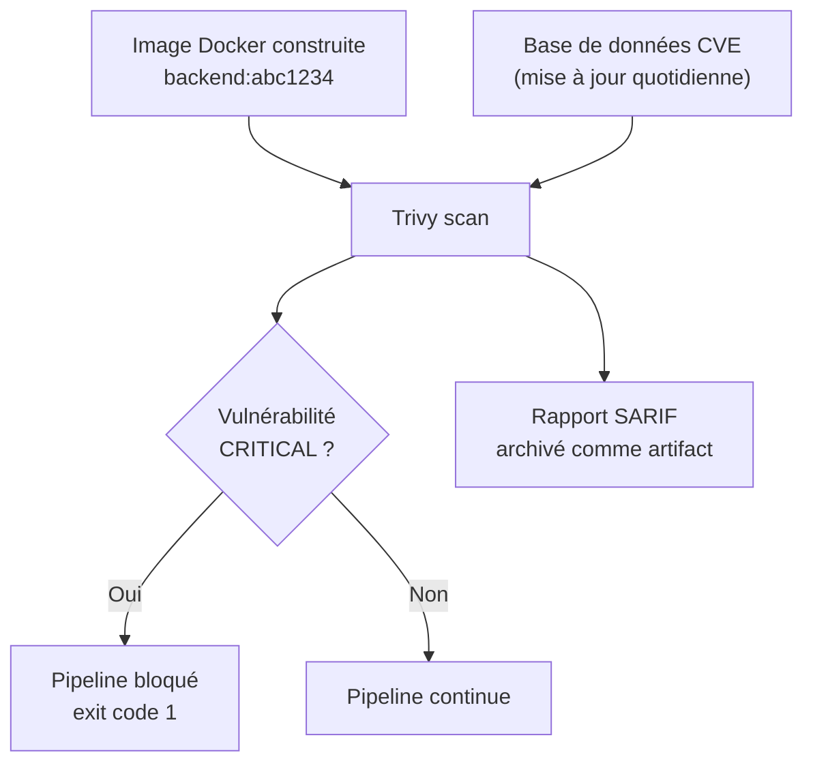
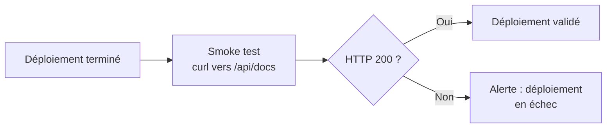
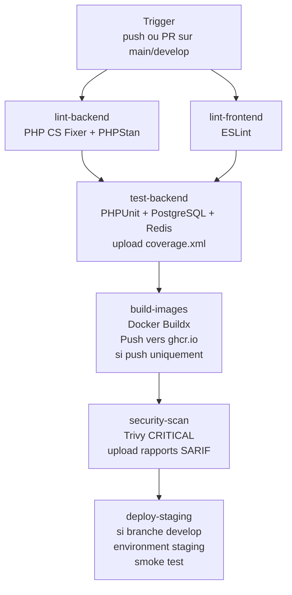

# 6. Pipeline CI/CD avec GitHub Actions

## Le problème : "ça marche sur ma machine"

Vous avez déjà vécu cette scène : vous terminez une fonctionnalité,
tout fonctionne en local, vous poussez le code sur le dépôt partagé,
et un collègue vous dit que l'application ne démarre plus. Ou pire :
le code part en production avec un bug qui aurait pu être détecté par
un simple test automatique.

C'est le problème que résout l'intégration et la livraison continues,
abrégées **CI/CD** (Continuous Integration / Continuous Delivery).

L'idée est simple : à chaque modification du code, une série de
vérifications automatiques s'exécute — style, tests, sécurité, build
— et bloque toute progression si quelque chose échoue. Personne ne
peut "oublier" de lancer les tests : la machine s'en charge.

### L'analogie de la chaîne de montage

Imaginez une usine automobile. Quand une voiture sort de la chaîne,
elle ne passe pas directement chez le client. Elle traverse d'abord
des postes de contrôle successifs : vérification mécanique,
vérification électrique, test de la carrosserie, contrôle final.
Chaque poste peut bloquer la chaîne si un défaut est détecté.

Un pipeline CI/CD fonctionne exactement de la même façon. Votre code
est la voiture, chaque job est un poste de contrôle, et le déploiement
est la livraison au client.



---

## GitHub Actions : les concepts fondamentaux

GitHub Actions est l'outil de CI/CD intégré à GitHub. Avant d'écrire
du YAML, il faut maîtriser cinq concepts clés.

### Le workflow

Un workflow est un **fichier YAML** placé dans `.github/workflows/`.
Il décrit quand le pipeline se déclenche et quels travaux il exécute.
Un repository peut avoir plusieurs workflows (un pour la CI, un pour
les releases, etc.).

### Le trigger (déclencheur)

Le trigger définit l'événement qui lance le workflow. Les plus courants
sont `push` (quand on pousse du code) et `pull_request` (quand on ouvre
une PR). On peut filtrer sur des branches précises.

```yaml
on:
  push:
    branches: [ main, develop ]
  pull_request:
    branches: [ main, develop ]
```

### Le job

Un job est une **unité de travail** qui s'exécute sur une machine
virtuelle (le runner). Par défaut, les jobs d'un même workflow
s'exécutent **en parallèle**. Pour forcer un ordre, on utilise `needs`.

```yaml
jobs:
  premier-job:
    runs-on: ubuntu-latest
    # ...

  deuxieme-job:
    runs-on: ubuntu-latest
    needs: premier-job  # attend que premier-job réussisse
    # ...
```

### Le step

À l'intérieur d'un job, les steps sont les **actions élémentaires**
exécutées dans l'ordre, l'une après l'autre, sur la même machine.
Un step peut soit exécuter une commande shell (`run`), soit invoquer
une action préexistante (`uses`).

```yaml
steps:
  - name: Récupérer le code
    uses: actions/checkout@v4          # action réutilisable

  - name: Installer les dépendances
    run: composer install              # commande shell
```

### L'action

Une action est un module réutilisable publié sur le marketplace
GitHub. C'est comme une librairie : plutôt que d'écrire 40 lignes
pour installer PHP, vous utilisez `shivammathur/setup-php@v2` en
quelques lignes. Le `@v4`, `@v3`, etc. indique la version.

### Vue d'ensemble



---

## Les dépendances entre jobs : orchestrer le pipeline

Par défaut, GitHub Actions lance tous les jobs en même temps. C'est
efficace, mais parfois dangereux : lancer les tests si le code ne
compile même pas est une perte de temps.

Le mot-clé `needs` permet de créer un **graphe de dépendances**. Un
job avec `needs: [A, B]` attend que A **et** B réussissent tous les
deux avant de démarrer.

### Le pipeline du lab



Les deux jobs de lint s'exécutent **en parallèle** car ils sont
indépendants. Les tests attendent les deux lints. Le build attend les
tests, et ainsi de suite.

### Les conditions `if`

Certains jobs ne doivent pas toujours s'exécuter. La clé `if` permet
d'ajouter une condition :

```yaml
# Ne builder que sur un push réel (pas sur une PR)
build-images:
  if: github.event_name == 'push'

# Ne déployer que sur la branche develop
deploy-staging:
  if: github.ref == 'refs/heads/develop'
```

Ces variables (`github.event_name`, `github.ref`) font partie du
**contexte GitHub** : un ensemble d'informations disponibles dans
tout le workflow sur l'événement en cours, le dépôt, l'acteur, etc.

---

## Le cache : éviter de tout réinstaller à chaque fois

### L'analogie du garde-manger

Imaginez un cuisinier qui, chaque matin, va au marché acheter les
mêmes ingrédients de base — farine, œufs, beurre — avant de préparer
le plat du jour. C'est inefficace. Un cuisinier malin garde un
garde-manger rempli et ne va au marché que si un ingrédient manque.

GitHub Actions fonctionne sur des machines virtuelles fraîches à
chaque exécution. Sans cache, `composer install` ou `npm ci` télécharge
des centaines de packages depuis Internet à chaque pipeline. Avec
le cache, le dossier `vendor` ou `node_modules` est restauré depuis
un stockage rapide si les dépendances n'ont pas changé.

### Fonctionnement du cache

L'action `actions/cache@v4` fonctionne en deux temps :

1. **Avant le job** : si une entrée de cache existe pour la `key`
   donnée, elle est restaurée dans le `path` indiqué.
2. **Après le job** : si aucune entrée n'existait, le contenu du
   `path` est sauvegardé sous cette clé.

La `key` est calculée à partir d'un hash du fichier de verrouillage
des dépendances (`composer.lock` ou `package-lock.json`). Si ce
fichier n'a pas changé, le cache est intact. S'il change (nouvelles
dépendances), une nouvelle clé est calculée et le cache est invalidé.



```yaml
- name: Cache Composer
  uses: actions/cache@v4
  with:
    path: api/vendor            # dossier à mettre en cache
    key: composer-${{ hashFiles('api/composer.lock') }}
    restore-keys: composer-     # clé de fallback partielle
```

---

## Les services : lancer des dépendances à côté du job

### L'analogie des vestiaires

Pour jouer au foot, les joueurs ont besoin de vestiaires avant
d'entrer sur le terrain. Les vestiaires existent pour le match, puis
sont libérés. GitHub Actions offre le même mécanisme pour les bases
de données et autres serveurs : les **services**.

Un service est un **conteneur Docker** qui démarre avant les steps
du job et qui est accessible via `localhost`. Il s'arrête automatique-
ment à la fin du job. C'est ainsi que les tests PHPUnit peuvent parler
à une vraie base PostgreSQL sans que vous ayez à l'installer sur
le runner.



Un point important : les services démarrent de façon asynchrone.
Pour PostgreSQL, il faut attendre qu'il soit prêt avant de s'y
connecter. C'est le rôle du **healthcheck** :

```yaml
services:
  postgres:
    image: postgres:16-alpine
    ports:
      - 5432:5432
    options: >-
      --health-cmd "pg_isready -U yapuka"
      --health-interval 10s
      --health-timeout 5s
      --health-retries 5
```

GitHub Actions attend que le healthcheck réussisse avant de lancer
les steps du job.

<note>
Dans Docker Compose, le backend parle à la base via le nom de service
`database`. En CI, il n'y a pas de réseau Docker inter-conteneurs :
tout passe par `localhost`. La `DATABASE_URL` doit donc utiliser
`localhost` comme hôte.
</note>

---

## Docker Buildx et le GitHub Container Registry

### Construire et stocker des images

Une fois les tests validés, le pipeline construit les images Docker
et les publie sur un **registry**, c'est-à-dire un entrepôt d'images
accessible à distance. Le registry utilisé ici est le **GitHub
Container Registry** (ghcr.io), intégré directement à votre dépôt
GitHub.

### L'analogie de la bibliothèque

Pensez au registry comme à une bibliothèque publique. Quand vous
construisez une nouvelle image, vous déposez un exemplaire à la
bibliothèque avec deux étiquettes : une étiquette `latest` ("dernière
version disponible") et une étiquette avec l'empreinte exacte du
commit (`sha`). N'importe qui ayant les droits peut ensuite emprunter
cette image pour la déployer.



L'étiquette `latest` pointe toujours vers la version la plus récente.
L'étiquette basée sur le SHA du commit permet de remonter dans le
temps et de déployer une version précise — essentiel pour les rollbacks.

### Docker Buildx et le cache de layers

Docker Buildx est le moteur de build moderne de Docker. Il apporte
notamment la gestion du cache des **layers**. Chaque instruction d'un
Dockerfile produit une layer ; si une layer n'a pas changé depuis la
dernière exécution, elle est réutilisée.

```yaml
- uses: docker/build-push-action@v5
  with:
    context: ./api
    push: true
    tags: |
      ghcr.io/${{ github.repository }}/backend:latest
      ghcr.io/${{ github.repository }}/backend:${{ github.sha }}
    cache-from: type=gha   # lire le cache depuis GitHub Actions
    cache-to: type=gha,mode=max  # sauvegarder le cache
```

### S'authentifier au registry

Le registry GHCR nécessite une authentification. Dans GitHub Actions,
le token `GITHUB_TOKEN` est disponible automatiquement sans aucune
configuration de votre part. Il suffit de l'utiliser dans l'action
de login :

```yaml
- uses: docker/login-action@v3
  with:
    registry: ghcr.io
    username: ${{ github.actor }}     # votre nom d'utilisateur GitHub
    password: ${{ secrets.GITHUB_TOKEN }}  # token automatique
```

---

## Le scan de sécurité avec Trivy

### Pourquoi scanner les images ?

Une image Docker est construite à partir d'une image de base (par
exemple `php:8.4-fpm`) qui contient des dizaines de packages système.
Ces packages peuvent avoir des **vulnérabilités connues** (CVE —
Common Vulnerabilities and Exposures). Trivy est un scanner qui
compare le contenu d'une image à une base de données de vulnérabilités
et produit un rapport.

### L'analogie du détecteur de métaux

Imaginez les contrôles de sécurité à l'aéroport. Chaque passager
passe sous le détecteur de métaux avant d'embarquer. Si une alerte
se déclenche, l'embarquement est bloqué jusqu'à résolution. Trivy
joue le même rôle pour vos images Docker.



Trivy peut produire deux types de sortie : un tableau lisible dans
les logs du pipeline, et un fichier SARIF (Security Analysis Results
Interchange Format) archivé comme artifact pour être consulté plus
tard.

Le paramètre `exit-code: '1'` est clé : il fait échouer le step si
des vulnérabilités du niveau demandé sont trouvées, ce qui bloque
toute la suite du pipeline.

---

## Les environments et le déploiement

### Les environments GitHub

Un "environment" GitHub est plus qu'un simple mot dans votre YAML.
C'est une entité configurée dans les Settings du dépôt qui permet :

- de suivre l'historique des déploiements dans l'onglet Environments
- de définir des **règles de protection** (approval manuelle obligatoire
  avant le déploiement en production, par exemple)
- de stocker des **secrets** propres à cet environnement

```yaml
deploy-staging:
  environment:
    name: staging
    url: https://staging.yapuka.dev
```

### Le smoke test

Après un déploiement, un **smoke test** vérifie en quelques secondes
que l'application répond. C'est le test minimal — "est-ce que ça
fume ?" (est-ce que ça tourne ?) — avant de déclarer le déploiement
réussi.



---

## Les variables et les secrets

### Contexte GitHub (`github.*`)

Le contexte `github` donne accès à des informations sur l'événement
déclencheur :

| Variable            | Contenu                                                 |
|---------------------|---------------------------------------------------------|
| `github.actor`      | Nom de l'utilisateur qui a déclenché le workflow        |
| `github.sha`        | SHA du commit en cours                                  |
| `github.ref`        | Référence complète de la branche (`refs/heads/develop`) |
| `github.ref_name`   | Nom court de la branche (`develop`)                     |
| `github.repository` | `organisation/nom-du-depot`                             |
| `github.event_name` | Nom de l'événement (`push`, `pull_request`)             |

### Variables d'environnement

On peut définir des variables à trois niveaux : au niveau du workflow
entier (`env:` global), au niveau d'un job, ou au niveau d'un step.

```yaml
env:
  REGISTRY: ghcr.io        # disponible dans tout le workflow

jobs:
  mon-job:
    env:
      APP_ENV: test         # disponible dans ce job uniquement
    steps:
      - run: echo $REGISTRY   # affiche ghcr.io
```

### Les secrets

Les informations sensibles (mots de passe, tokens d'API) ne doivent
jamais être écrits en clair dans un fichier YAML. GitHub propose un
coffre-fort de secrets accessibles via `${{ secrets.NOM_DU_SECRET }}`.

Le secret `GITHUB_TOKEN` est particulier : il est **créé automatiquement**
par GitHub pour chaque exécution de workflow, avec des droits limités
au dépôt en cours. Vous n'avez rien à configurer.

---

## Les artifacts

Un artifact est un **fichier produit par le pipeline** que vous
souhaitez conserver après la fin du job. Les runners sont éphémères :
tout ce qui n'est pas sauvegardé est perdu. Les artifacts typiques
sont les rapports de tests, les rapports de couverture de code, et
les rapports de sécurité.

```yaml
- uses: actions/upload-artifact@v4
  if: always()     # sauvegarder même si le job a échoué
  with:
    name: backend-coverage
    path: api/coverage.xml
```

Le `if: always()` est important : sans lui, si le step précédent échoue,
l'upload ne s'exécute pas et le rapport est perdu alors qu'il aurait
pu aider à comprendre l'échec.

---

## Récapitulatif : le pipeline complet du lab



Chaque case de ce schéma correspond à un **job** dans votre fichier
`ci-cd.yml`. Chaque job est un programme indépendant qui reçoit une
machine virtuelle fraîche, installe ses dépendances, et exécute ses
steps dans l'ordre.

Vous avez maintenant toutes les clés conceptuelles pour réaliser le
lab. Bonne construction de pipeline.