# 7. Orchestration avec Docker Swarm

## Introduction

### Pourquoi un seul serveur ne suffit plus ?

Imaginez un restaurant qui cartonne un samedi soir. Une seule table, un seul
serveur, une seule cuisinière. Si la cuisinière tombe malade, le restaurant
ferme. Si dix clients arrivent en même temps, tout le monde attend une heure.
Si un plat est en rupture, la soirée est gâchée pour ceux qui l'avaient choisi.

C'est exactement le problème que vous rencontrez quand vous déployez une
application sur **un seul serveur** :

- Si la machine tombe en panne, l'application est inaccessible.
- Si la charge explose (succès soudain, flash sale, etc.), le serveur sature.
- Si vous déployez une nouvelle version, vous devez couper le service.

La solution, comme pour le restaurant, c'est d'**engager plusieurs personnes
et de les coordonner**. En informatique, on appelle cela l'**orchestration**.

Docker Swarm est l'outil natif de Docker qui permet de transformer un ensemble
de machines indépendantes en un **cluster coordonné**, capable de distribuer
le travail, de tolérer les pannes et de s'adapter à la charge.

### L'analogie du restaurant étoilé

Reprenons notre restaurant, mais cette fois il est devenu un groupe de
restauration avec trois établissements dans la même ville :

- Un **établissement principal** (le manager) qui gère les réservations,
  coordonne les équipes, décide qui fait quoi et surveille l'ensemble.
- Deux **établissements secondaires** (les workers) qui reçoivent les clients
  et préparent les plats, sans se soucier de la coordination globale.

Quand un client réserve, peu importe dans quel établissement il se rend :
l'expérience est identique, le menu est le même, le service est équivalent.
Si un établissement ferme pour travaux, les réservations sont automatiquement
redirigées vers les deux autres. Si un soir est particulièrement chargé, on
ouvre des tables supplémentaires dans les établissements disponibles.

C'est exactement ce que fait Docker Swarm avec vos conteneurs.

### Ce que vous allez construire

Dans ce lab, vous allez construire ce cluster de trois machines :

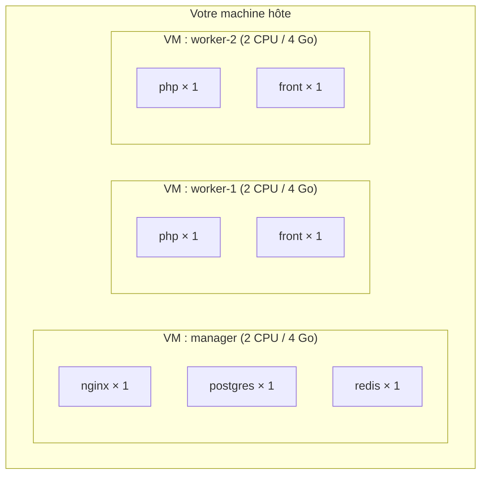

Vous allez ensuite tester le scaling, la mise à jour sans interruption, et la
résistance aux pannes.

---

## Les concepts fondamentaux

### Le cluster Swarm : une flotte de machines

Un **cluster** est un groupe de machines qui fonctionnent ensemble comme si
elles n'en formaient qu'une seule. Pour Docker, un cluster Swarm est un
ensemble de moteurs Docker qui se connaissent et se font confiance.

Dans ce cluster, chaque machine est appelée un **nœud** (node en anglais).
Il en existe deux types :

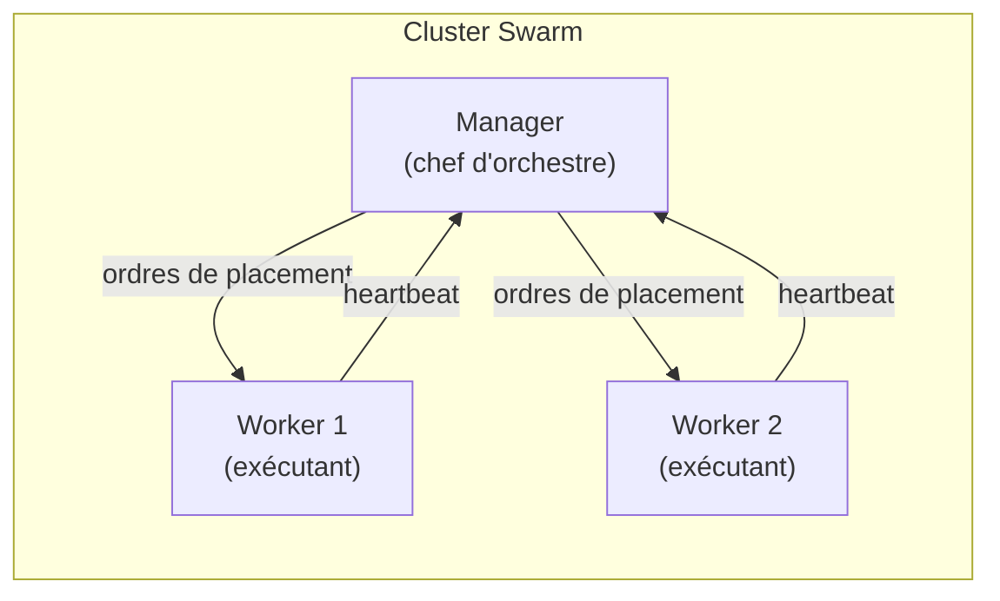

Le **manager** est le chef d'orchestre. Il :

- Maintient l'état souhaité du cluster (combien de replicas de chaque service,
  sur quels nœuds, etc.)
- Prend les décisions de placement : "ce conteneur ira sur worker-1"
- Expose l'API Swarm : c'est là qu'on exécute toutes les commandes
  `docker service`, `docker stack`, etc.
- Surveille en permanence que tout se passe comme prévu

Les **workers** sont les exécutants. Ils :

- Reçoivent les ordres du manager
- Font tourner les conteneurs (appelés *tasks* dans le vocabulaire Swarm)
- Envoient régulièrement un signal au manager pour lui dire "je suis toujours
  là et tout va bien" (c'est le *heartbeat*)
- Ne prennent aucune décision autonome

> **Note** : un manager peut aussi faire tourner des conteneurs, mais en
> production on évite généralement de le surcharger pour qu'il reste réactif.
> Dans ce lab, les services avec état (base de données, cache) seront placés
> sur le manager pour des raisons de persistance de données.

### L'algorithme Raft : comment les managers se mettent d'accord

Pourquoi recommande-t-on un nombre impair de managers ? Parce que Swarm
utilise l'algorithme de consensus **Raft** pour élire un leader unique parmi
les managers et prendre des décisions.

Imaginez un jury de tribunal : pour condamner ou acquitter, il faut une
**majorité**. Avec 3 jurés, on peut prendre une décision même si l'un est
absent (2 sur 3). Avec 2 jurés, si l'un est absent, on ne peut plus décider.

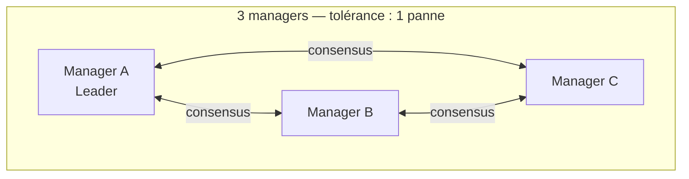

| Nombre de managers | Pannes tolérées | Quorum requis |
|--------------------|-----------------|---------------|
| 1                  | 0               | 1             |
| 3                  | 1               | 2             |
| 5                  | 2               | 3             |

Dans ce lab, vous n'avez qu'un seul manager — c'est suffisant pour
l'apprentissage, mais pas pour la production.

---

## Les services, tasks et replicas

### La hiérarchie des objets Swarm

En Docker Compose, on parle de **conteneurs**. En Swarm, le vocabulaire change
légèrement :

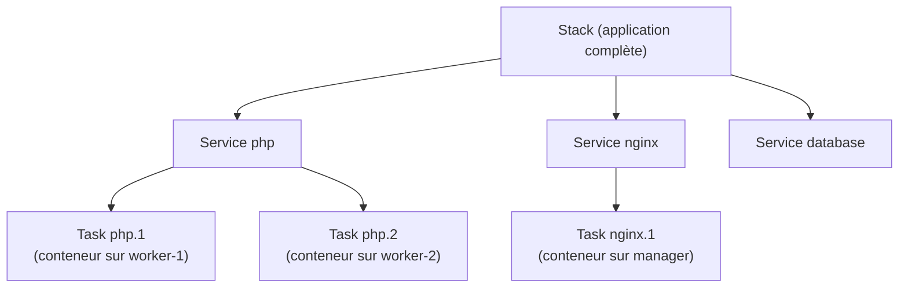

- Une **stack** représente votre application complète, définie dans un fichier
  YAML (l'équivalent du `docker-compose.yml` mais pour Swarm).
- Un **service** est la définition d'un composant : quelle image utiliser,
  combien de replicas, quelles ressources, etc.
- Une **task** est l'instance concrète d'un service sur un nœud précis. Une
  task = un conteneur qui tourne quelque part dans le cluster.
- Les **replicas** sont le nombre de tasks simultanées pour un service. Si un
  service a 3 replicas, il y a 3 tasks (3 conteneurs) qui tournent en
  parallèle.

### Le principe des replicas : plusieurs cuisiniers pour le même plat

Toujours avec notre analogie du restaurant : un replica, c'est comme avoir
plusieurs cuisiniers capables de préparer le même plat. Si l'un est absent,
les autres continuent. Si la commande afflue, on peut en appeler davantage.

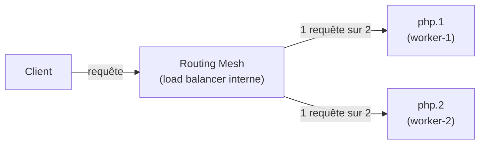

Le load balancer interne de Swarm (le **routing mesh**) distribue
automatiquement les requêtes entre les replicas disponibles. Vous n'avez rien
à configurer.

---

## Le routing mesh : la magie du réseau Swarm

### Comment une requête arrive à son destinataire

C'est l'une des fonctionnalités les plus remarquables de Swarm. Imaginez que
vous publiez le port 8080 pour votre service nginx. Grâce au routing mesh,
ce port est disponible sur **tous les nœuds du cluster**, même ceux qui ne
font pas tourner ce service.

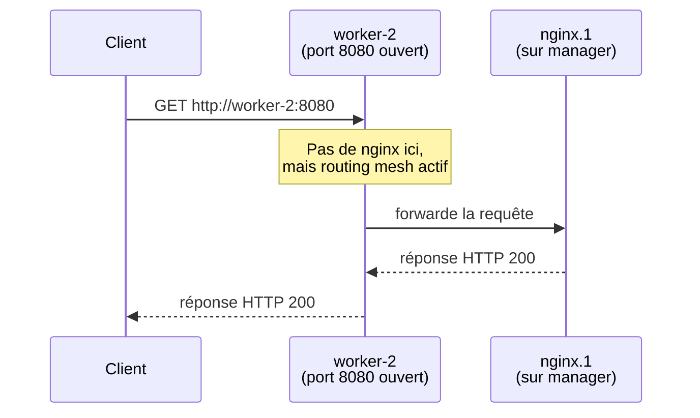

Concrètement : si vous connaissez l'adresse IP de n'importe quel nœud et le
port publié du service, vous pouvez y accéder. Le cluster se charge de router
la requête vers le bon conteneur.

### Le réseau overlay : le câble réseau virtuel du cluster

En Docker Compose, les conteneurs communiquent via un réseau **bridge** :
un réseau local à **une seule machine**. En Swarm, les conteneurs sont sur
des machines différentes. Il faut donc un réseau qui traverse les machines.

C'est le rôle du réseau **overlay** : il crée un réseau virtuel qui s'étend
sur tous les nœuds du cluster. Les conteneurs sur des machines différentes
peuvent se parler comme s'ils étaient sur le même réseau local.

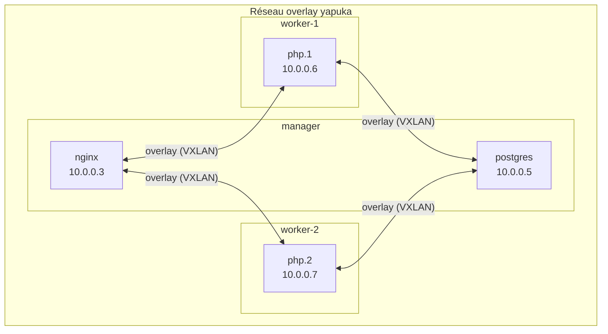

Techniquement, l'overlay encapsule les paquets réseau dans un tunnel **VXLAN**
(Virtual eXtensible LAN). Vous n'avez pas besoin de comprendre les détails :
retenez juste que dans votre `stack.yml`, vous déclarez un réseau de type
`overlay` et Swarm s'occupe du reste.

---

## Du docker-compose.yml au stack.yml

### Ce qui change et pourquoi

Votre fichier `docker-compose.yml` du projet Yapuka fonctionne parfaitement
en développement. Mais Swarm impose quelques adaptations importantes.

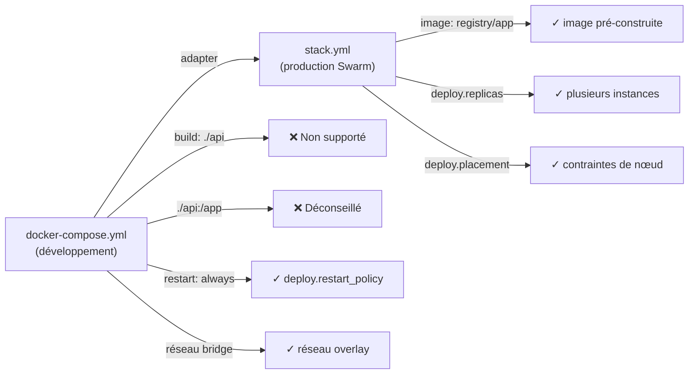

Les différences clés à comprendre :

**1. Plus de `build:`, uniquement des `image:`**

En Compose, Docker peut construire l'image sur place. En Swarm, les workers
doivent pouvoir *tirer* l'image depuis un registry. Ils ne peuvent pas
construire — ils n'ont pas le code source. Toutes les images doivent donc être
pré-construites et stockées dans un registry accessible.

**2. Plus de bind mounts de développement**

En Compose, vous montez souvent votre code source dans le conteneur :
`./api:/var/www/api`. En Swarm, le code source n'est pas sur les workers —
il n'est que sur votre machine de développement (ou sur le manager). Les
workers n'ont pas accès à ce chemin. On utilise des **images auto-suffisantes**
qui contiennent le code.

**3. La section `deploy:`**

C'est la grande nouveauté du stack.yml. Cette section est ignorée par Docker
Compose mais lue par Swarm. Elle contient :

```yaml
deploy:
  replicas: 2            # Nombre d'instances simultanées
  restart_policy:
    condition: on-failure # Redémarrer si le conteneur crashe
  placement:
    constraints:
      - node.role == worker # Sur quels nœuds le placer
  update_config:
    parallelism: 1       # Mettre à jour 1 replica à la fois
    delay: 10s           # Attendre 10s entre chaque
```

**4. Le réseau overlay**

Dans votre `docker-compose.yml`, le réseau est implicitement de type `bridge`.
Dans le `stack.yml`, vous devez spécifier `driver: overlay` pour que le réseau
s'étende sur tout le cluster.

---

## Le registry privé : le garde-manger partagé

### Pourquoi un registry est indispensable en Swarm

Pensez à un registry Docker comme à un garde-manger partagé entre tous les
cuisiniers (les workers). Quand le manager dit "déploie 2 replicas de l'image
`yapuka-php`", les workers doivent pouvoir aller chercher cette image quelque
part. Si l'image n'est que sur votre machine locale, ils ne peuvent pas y
accéder.

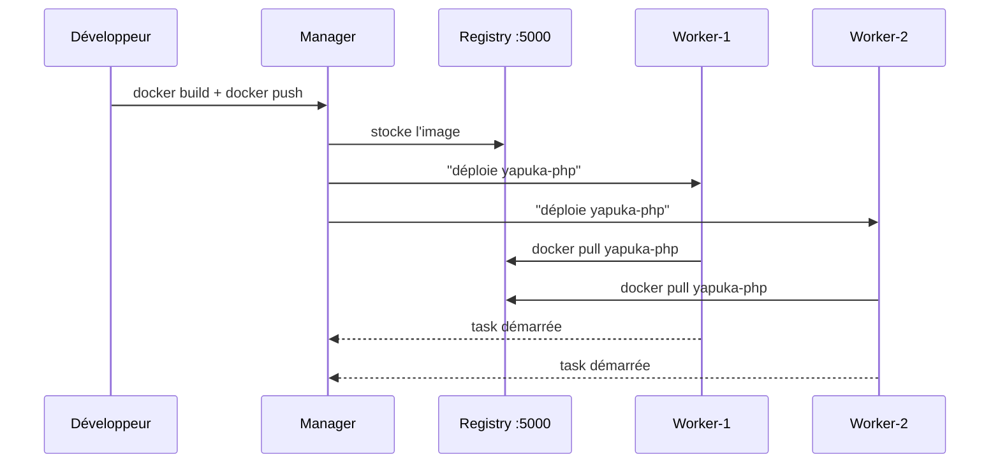

Dans ce lab, vous utiliserez un **registry privé local** déployé sur le
manager (image officielle `registry:2`, port 5000). C'est une solution
simple pour un environnement de lab. En production, on utiliserait Docker Hub,
AWS ECR, GitLab Registry, etc.

Les images publiques (nginx, postgres, redis) sont tirées directement depuis
Docker Hub par chaque worker — pas besoin de les pousser dans le registry
local.

---

## La haute disponibilité : Swarm répare tout seul

### Le self-healing : le cluster qui se soigne lui-même

C'est la promesse centrale de l'orchestration : si quelque chose tombe,
le système se répare tout seul, sans intervention humaine.

Swarm maintient en permanence l'état souhaité (*desired state*). Si la réalité
diverge de cet état, il prend des mesures correctives.

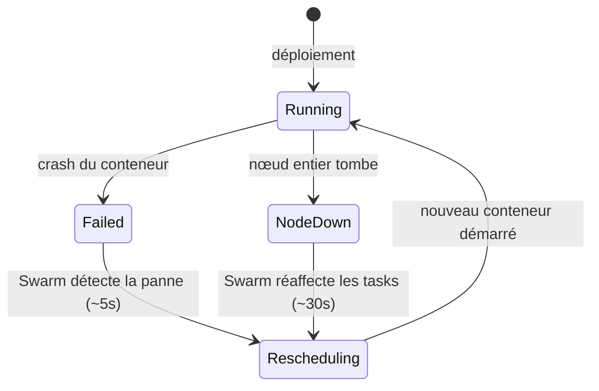

**Scénario 1 : un conteneur crashe**

Un conteneur PHP lève une exception fatale et s'arrête. Swarm le détecte
en quelques secondes et redémarre immédiatement un nouveau conteneur sur le
même nœud (ou un autre si nécessaire). L'utilisateur perçoit peut-être une
brève erreur, mais le service est restauré automatiquement.

**Scénario 2 : un nœud entier tombe en panne**

Le worker-1 perd l'alimentation électrique. Le manager n'a plus de heartbeat
depuis ce nœud. Après environ 5 à 30 secondes, il le déclare `Down` et
replanifie toutes ses tasks sur les nœuds restants.

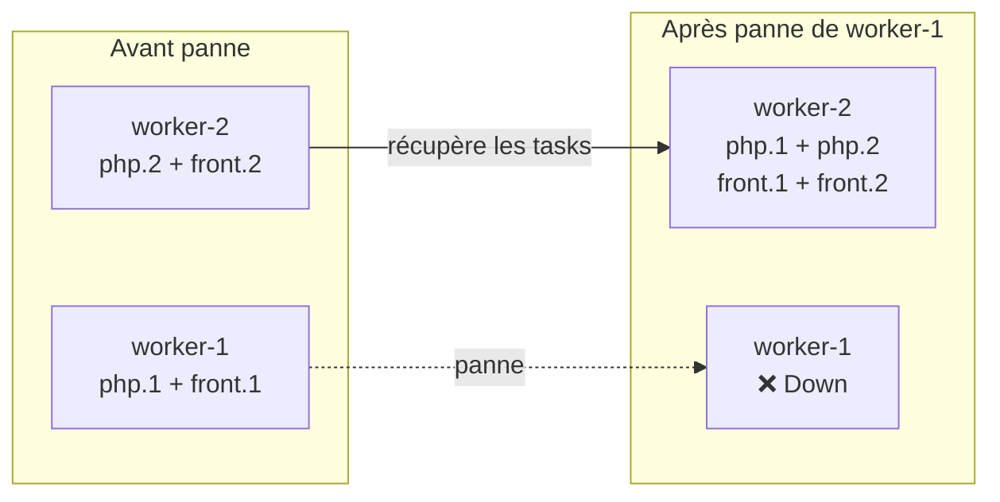

> **Point important** : quand worker-1 revient en ligne, Swarm ne rééquilibre
> pas automatiquement les tasks. Les conteneurs restent sur worker-2. Pour
> forcer un rééquilibrage, il faut utiliser
> `docker service update --force <service>`.

---

## Le rolling update : mettre à jour sans jamais couper

### La mise à jour progressive, replica par replica

Imaginez un restaurant qui veut changer de recette pour son plat signature.
Plutôt que de fermer toute la cuisine pour une journée de formation, il forme
un cuisinier à la fois. Pendant que l'un apprend la nouvelle recette, les
autres continuent de servir les clients avec l'ancienne. Quand le premier est
formé, on passe au suivant.

C'est exactement le fonctionnement du **rolling update** de Swarm.

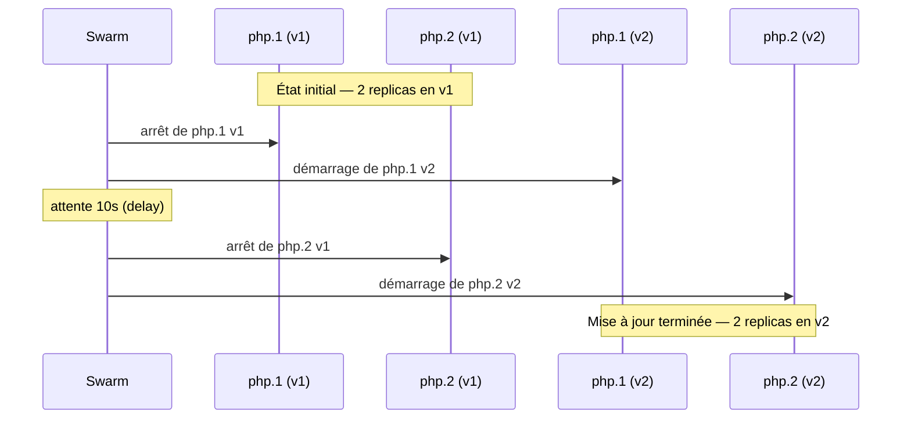

Pendant toute la durée de la mise à jour, au moins un replica de l'ancienne
version reste actif. Le routing mesh continue d'envoyer les requêtes vers les
replicas disponibles. L'application ne connaît aucune interruption.

La configuration se fait dans la section `deploy.update_config` du
`stack.yml` :

```yaml
update_config:
  parallelism: 1   # Mettre à jour 1 replica à la fois
  delay: 10s       # Attendre 10s avant le replica suivant
```

### Le rollback : revenir en arrière en une commande

Si la v2 est défectueuse, Swarm conserve la configuration précédente et
permet un retour immédiat :

```
docker service rollback yapuka_php
```

Swarm remplace alors les replicas v2 par des replicas v1, avec le même
mécanisme progressif.

---

## Les Docker configs : distribuer des fichiers dans le cluster

### Un problème spécifique à Swarm

En Docker Compose, vous montez votre fichier de configuration Nginx avec un
bind mount :

```yaml
volumes:
  - ./docker/nginx/default.conf:/etc/nginx/conf.d/default.conf
```

En Swarm, ce fichier n'existe que sur votre machine ou sur le manager. Si
Nginx devait tourner sur un worker, ce worker n'aurait pas accès à ce chemin.

La solution : **Docker configs**. C'est un mécanisme de Swarm qui stocke des
fichiers de configuration dans la base de données du cluster et les distribue
automatiquement à tous les conteneurs qui en ont besoin, quel que soit le
nœud.

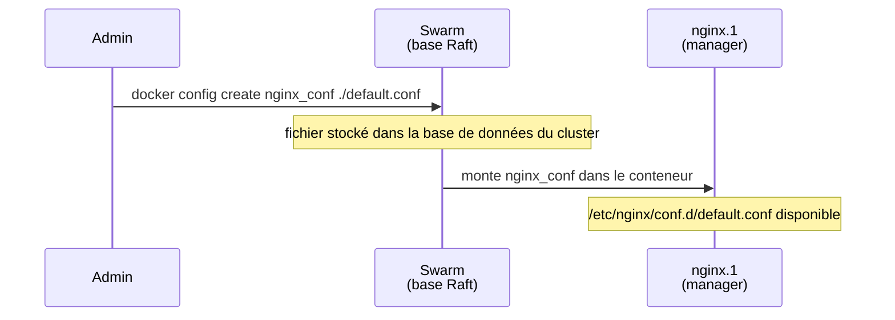

Dans le `stack.yml`, la référence à une config ressemble à ceci :

```yaml
configs:
  nginx_conf:
    external: true   # La config a été créée avant le déploiement

services:
  nginx:
    configs:
      - source: nginx_conf
        target: /etc/nginx/conf.d/default.conf
```

---

## Multipass : des VMs en quelques secondes

### Simuler un vrai cluster sur votre machine

Docker Swarm nécessite plusieurs machines distinctes. Pour ce lab, vous allez
les simuler grâce à **Multipass**, un outil de Canonical qui crée des VMs
Ubuntu légères en quelques secondes sur votre machine hôte.

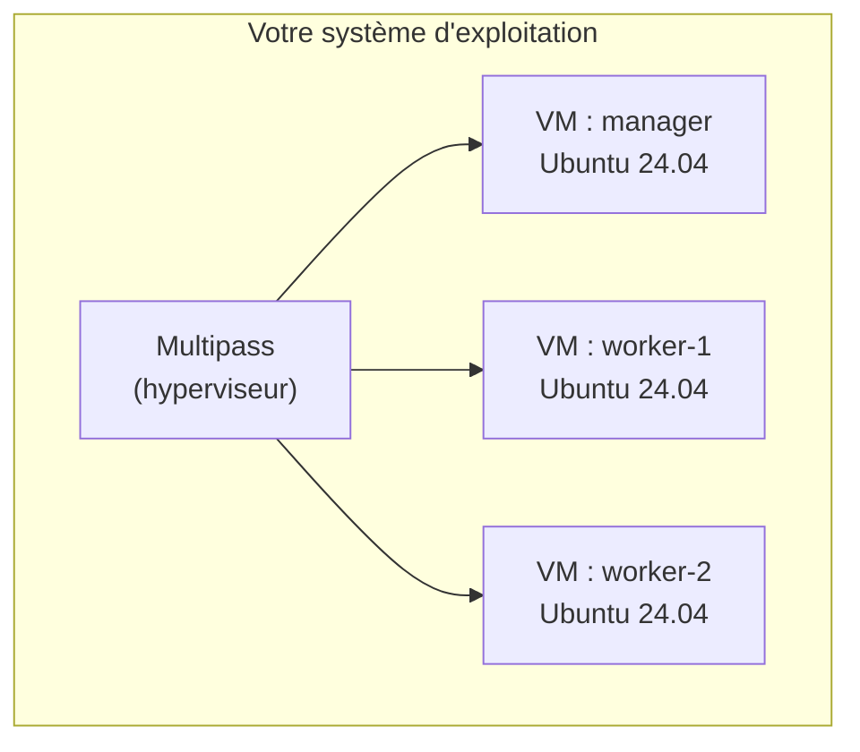

Les commandes essentielles pour ce lab :

| Action                       | Commande                                        |
|------------------------------|-------------------------------------------------|
| Créer une VM                 | `multipass launch --name <nom> --cpus 2 ...`   |
| Lister les VMs               | `multipass list`                                |
| Ouvrir un shell dans une VM  | `multipass shell <nom>`                         |
| Exécuter une commande        | `multipass exec <nom> -- <commande>`            |
| Transférer des fichiers      | `multipass transfer -r <src> <nom>:<dest>`      |
| Monter un dossier            | `multipass mount <src-locale> <nom>:<dest-vm>`  |
| Arrêter une VM               | `multipass stop <nom>`                          |
| Redémarrer une VM            | `multipass restart <nom>`                       |
| Supprimer une VM             | `multipass delete <nom> && multipass purge`     |

> **Note** : `multipass exec manager -- docker node ls` est l'équivalent de
> "connecte-toi au manager et exécute `docker node ls`". Vous n'avez pas
> besoin d'ouvrir un shell interactif pour chaque commande.

---

## Vue d'ensemble : le chemin complet du lab

Voici le fil conducteur de tout ce que vous allez faire, du début à la fin :

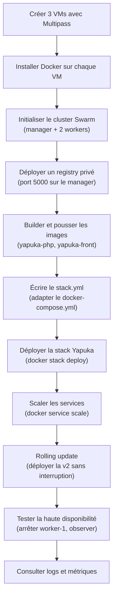

---

## Récapitulatif des concepts clés

Avant de vous lancer, voici les points essentiels à avoir en tête :

**Cluster et nœuds**

- Un cluster Swarm = plusieurs machines Docker qui coopèrent
- Manager = chef d'orchestre, prend les décisions
- Worker = exécutant, fait tourner les conteneurs (tasks)
- Heartbeat = signal régulier qu'envoie chaque nœud pour dire "je suis vivant"

**Services et déploiement**

- Stack = application complète décrite dans un fichier YAML
- Service = définition d'un composant (quelle image, combien de replicas)
- Task = instance concrète = un conteneur sur un nœud
- Replica = copie d'un service ; plusieurs replicas = haute disponibilité

**Réseau**

- Overlay = réseau virtuel qui s'étend sur tout le cluster (remplace bridge)
- Routing mesh = accès à un service depuis n'importe quel nœud du cluster

**Opérations**

- Rolling update = mise à jour progressive, replica par replica, sans coupure
- Rollback = retour à la version précédente en une commande
- Self-healing = Swarm redémarre automatiquement ce qui tombe
- Placement constraint = règle qui dit sur quel type de nœud déployer un
  service (`node.role == worker`, `node.hostname == manager`, etc.)

**Infrastructure**

- Registry privé = entrepôt d'images accessible à tous les nœuds du cluster
- Docker config = mécanisme de distribution de fichiers de configuration dans
  le cluster
- Multipass = outil pour créer des VMs Ubuntu légères sur votre machine locale

---

## Objectifs du module

Au terme de ce lab, vous serez capable de :

- Créer et configurer un cluster Docker Swarm multi-nœuds avec Multipass
- Adapter un fichier `docker-compose.yml` en `stack.yml` Swarm avec les
  sections `deploy`, `placement` et `update_config`
- Déployer et gérer une application multi-services en production sur Swarm
- Scaler horizontalement un service à la volée avec `docker service scale`
- Mettre à jour une application sans interruption grâce au rolling update et
  revenir en arrière avec un rollback
- Tester et observer les mécanismes de self-healing et de haute disponibilité