# 8. Déploiement cloud

## Du poste de développement à la production

Imaginez que vous avez construit un restaurant dans votre cuisine.
Les recettes sont parfaites, la disposition est idéale pour vous, et
tout fonctionne impeccablement — tant que vous êtes le seul client.
Mais le jour où vous voulez accueillir le public, vous devez ouvrir
un vrai établissement : un local, une adresse, une signalisation, des
stocks, et une cuisine capable de tenir la cadence.

Le déploiement, c'est exactement ce passage : faire passer votre
application de "ça marche sur ma machine" à "ça tourne pour tout le
monde, tout le temps".

Ce document vous donne les bases conceptuelles pour aborder le Lab 08
sereinement. Vous allez déployer le backend Symfony de Yapuka sur
**Render** et le frontend React sur **Vercel**, puis automatiser
l'ensemble avec **GitHub Actions**.

---

## 1. L'architecture séparée : frontend et backend sur des plateformes différentes

### Pourquoi séparer les deux ?

Pensez à une librairie en ligne. La vitrine — ce que vous voyez dans
votre navigateur — est composée de pages HTML, d'images et de
JavaScript. Elle peut être servie depuis n'importe quel point du
globe, très rapidement, sans avoir besoin d'une logique métier. Le
stock, les commandes, les comptes clients, en revanche, sont gérés
par un serveur central qui exécute du code, interroge une base de
données, et applique des règles métier.

Ces deux parties ont des besoins radicalement différents :

- Le **frontend** est statique : une fois compilé, c'est un ensemble
  de fichiers. Il bénéficie d'un réseau de diffusion mondial (CDN)
  qui les sert en quelques millisecondes depuis le serveur le plus
  proche de l'utilisateur.
- Le **backend** est dynamique : il exécute du code à chaque requête,
  accède à la base de données, et a besoin d'un environnement
  d'exécution stable (PHP, PostgreSQL, Redis...).

Vercel est spécialisé dans le premier cas. Render est adapté au
second.

### Vue d'ensemble de l'architecture

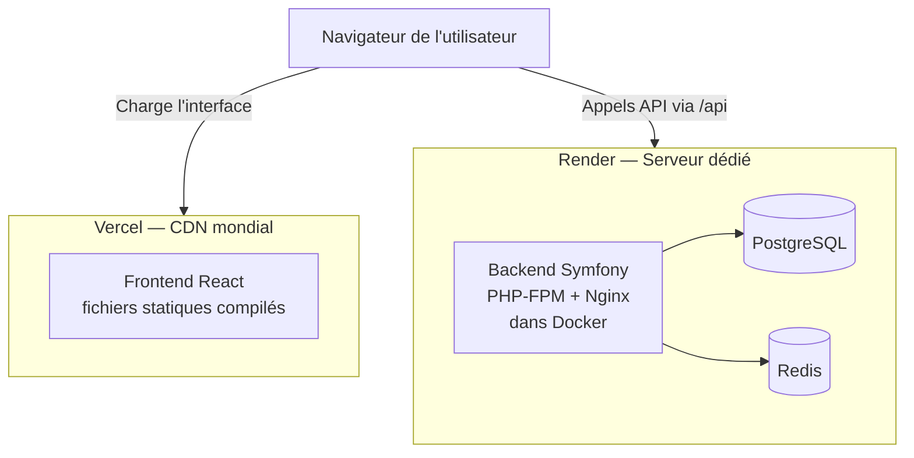

Le frontend ne communique jamais directement avec la base de données.
Toutes les données transitent par l'API Symfony.

---

## 2. Docker en production : empaqueter l'application

### L'analogie du conteneur maritime

Avant l'invention du conteneur maritime standardisé dans les années
1950, charger un bateau était un cauchemar logistique. Chaque
marchandise avait sa forme, sa fragilité, son emballage. Les dockers
devaient tout réorganiser manuellement à chaque port.

Le conteneur a tout changé : peu importe ce qu'il y a dedans, la
boîte est toujours de la même taille et s'empile de la même façon.
Un bateau peut en transporter des milliers sans se soucier du
contenu.

Docker fonctionne exactement de cette façon pour les applications.
Peu importe le serveur cible — votre machine, un serveur de test,
Render — le conteneur embarque tout ce dont l'application a besoin :
PHP, ses extensions, Nginx, les dépendances Composer. L'hôte n'a
qu'à savoir lancer des conteneurs.

### Le build multi-étapes

Pour la production, on utilise un **Dockerfile multi-étapes** qui
sépare la phase de construction de l'image finale.

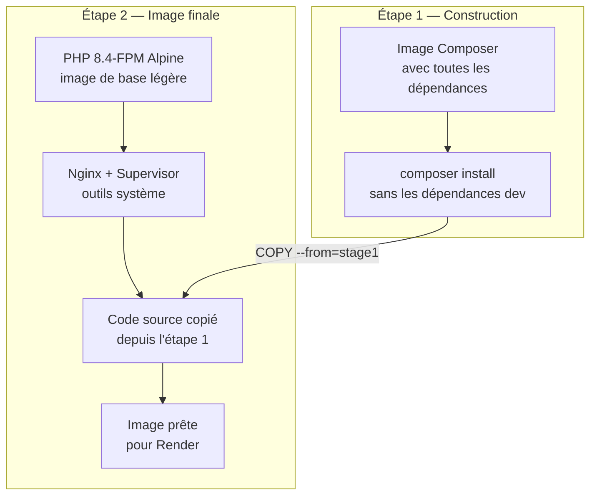

L'étape 1 installe les dépendances avec Composer (un outil qui
télécharge des bibliothèques). L'étape 2 ne récupère que le
résultat final — sans les outils de développement, sans le cache
Composer, ni les dépendances de test. L'image finale est ainsi bien
plus légère et sécurisée.

### PHP-FPM, Nginx et Supervisor

Dans votre environnement local, Docker Compose lance plusieurs
conteneurs : un pour PHP, un pour Nginx. En production sur Render,
vous ne disposez que d'un seul conteneur. Il faut donc faire
cohabiter les deux processus.

**Supervisor** est un gestionnaire de processus : il démarre
PHP-FPM et Nginx en parallèle à l'intérieur du même conteneur, et
les redémarre automatiquement s'ils s'arrêtent.

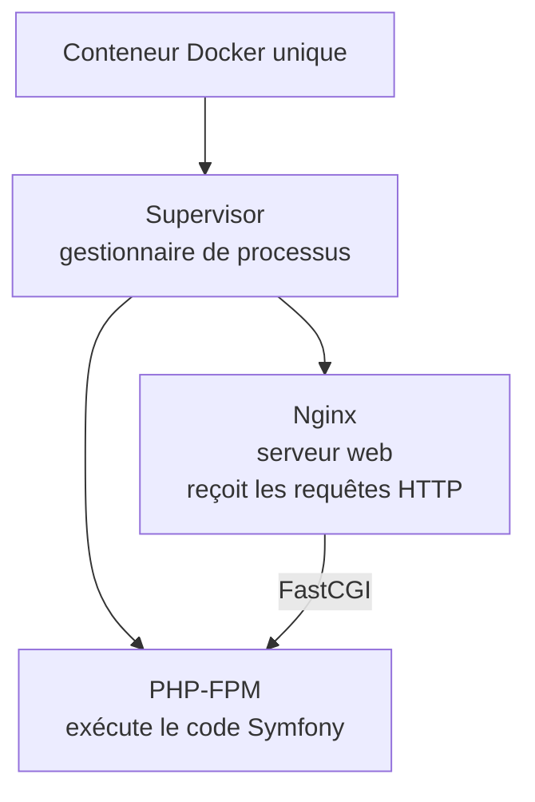

Nginx reçoit la requête HTTP et la transmet à PHP-FPM via le
protocole FastCGI. PHP-FPM exécute le code Symfony et renvoie la
réponse à Nginx, qui la retourne au client.

### Le port dynamique de Render

Render injecte automatiquement un numéro de port dans la variable
d'environnement `$PORT`. Votre configuration Nginx doit donc
écouter sur ce port et non sur un port fixe comme 80. Le script
`start.sh` remplace le placeholder `RENDER_PORT` dans la
configuration Nginx par la valeur réelle au démarrage du conteneur.

---

## 3. Les variables d'environnement : séparer le code de la configuration

### L'analogie des réglages d'usine

Une machine à café professionnelle est livrée avec ses réglages
d'usine, mais chaque café l'adapte à ses besoins : la température,
la pression, la quantité. Ces réglages ne font pas partie de la
machine elle-même — ils sont configurés après installation.

Les variables d'environnement jouent ce rôle dans une application.
Le code est identique sur tous les environnements. Ce qui change,
c'est la configuration injectée au démarrage :

- En développement : base de données locale, mode debug activé
- En production : base de données Render, mode prod, secrets réels

Cette séparation est fondamentale pour la sécurité. On ne met jamais
de mot de passe ou de clé secrète dans le code source.

### Les variables nécessaires pour Yapuka

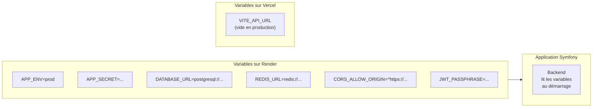

En production Vercel, `VITE_API_URL` est volontairement vide : les
appels vers `/api/*` sont interceptés par les **rewrites Vercel** et
redirigés vers Render automatiquement.

---

## 4. Les rewrites Vercel : masquer l'origine des appels API

### L'analogie du standard téléphonique

Dans une grande entreprise, quand vous appelez le "04 72 00 01 00",
le standard téléphonique redirige votre appel vers le bon
département. Depuis l'extérieur, vous n'avez qu'un seul numéro.
En interne, il peut y avoir des dizaines de lignes différentes.

Vercel propose le même mécanisme pour les appels HTTP. Le fichier
`vercel.json` indique que toute requête vers `/api/*` doit être
transmise à l'URL réelle du backend Render.

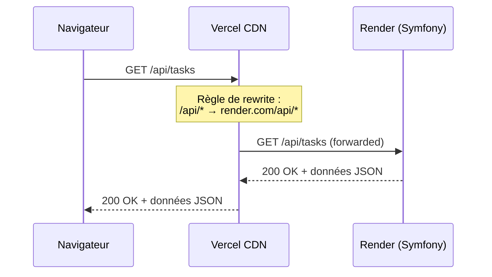

Cela présente deux avantages : d'abord, le navigateur ne connaît pas
l'URL réelle du backend (sécurité), ensuite cela évite les problèmes
de CORS que nous allons voir.

---

## 5. CORS : la politique du même domaine

### L'analogie du vigile de discothèque

Imaginez un vigile dont la mission est d'empêcher les gens d'entrer
s'ils viennent d'un autre établissement. Le serveur joue ce rôle
avec les requêtes HTTP : par défaut, un navigateur interdit à une
page chargée depuis `yapuka.vercel.app` d'appeler une API sur
`yapuka.onrender.com`. Les deux origines sont différentes.

**CORS** (Cross-Origin Resource Sharing) est le mécanisme qui permet
au serveur d'assouplir cette politique en déclarant explicitement
les origines autorisées.

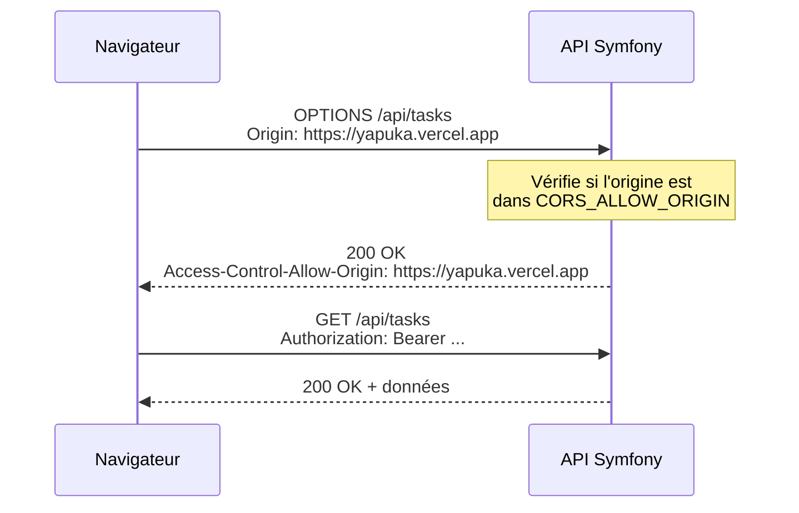

Le navigateur envoie d'abord une requête préliminaire (`OPTIONS`,
appelée "preflight") pour demander la permission. Si le serveur
répond avec l'en-tête `Access-Control-Allow-Origin` contenant
l'origine du frontend, le navigateur autorise l'appel réel.

Dans Symfony, la variable `CORS_ALLOW_ORIGIN` définit une expression
régulière des origines autorisées. Il faut qu'elle corresponde
exactement à l'URL de votre frontend Vercel.

<note>
Avec la stratégie des rewrites Vercel, les appels API semblent
provenir de Vercel lui-même — ce qui évite tout problème CORS. La
configuration CORS reste néanmoins nécessaire pour les appels directs
à l'API (outils de test, applications mobiles futures...).
</note>

---

## 6. Le pipeline CI/CD : automatiser pour livrer sans stress

### L'analogie de la chaîne de montage automobile

Dans une usine automobile, chaque voiture passe par une série de
postes de contrôle avant de sortir : soudure, peinture, tests
mécaniques, contrôle qualité. Personne ne livre une voiture qui n'a
pas passé tous les contrôles.

Un pipeline CI/CD fonctionne de la même façon pour votre code. À
chaque fois que vous poussez du code sur la branche principale,
une série d'étapes automatiques s'exécutent dans l'ordre.

**CI** (Intégration Continue) : les tests s'exécutent à chaque
modification pour détecter les régressions immédiatement.

**CD** (Déploiement Continu) : si tous les tests passent, le code
est déployé automatiquement en production.

### Le pipeline du Lab 08

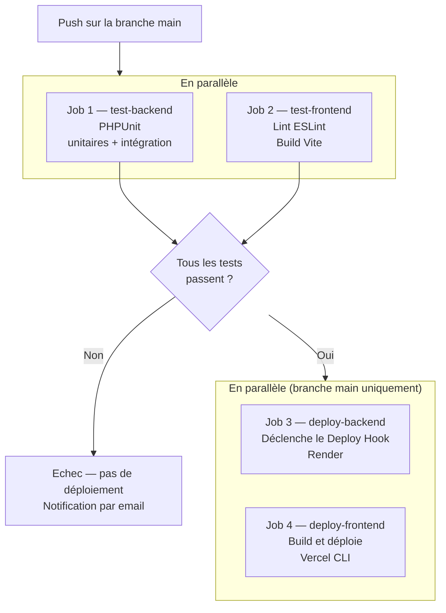

Les jobs 1 et 2 s'exécutent en parallèle pour gagner du temps.
Les jobs 3 et 4 ne démarrent que si les deux tests réussissent
**et** que le push se fait sur `main` (pas sur les pull requests).

### Les secrets GitHub

Le pipeline doit pouvoir appeler les API de Render et Vercel. Ces
clés sont des informations sensibles que l'on ne met jamais dans
le code source. GitHub propose un coffre-fort sécurisé : les
**Secrets** (Settings → Secrets and variables → Actions).

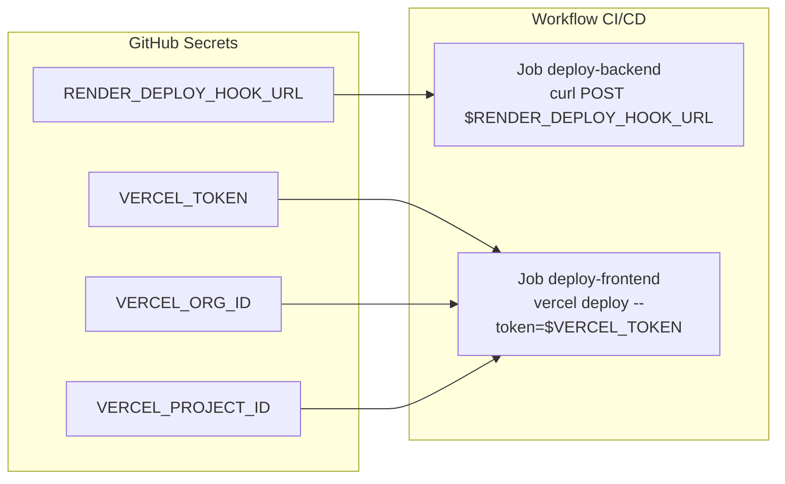

Le workflow accède à ces secrets via la syntaxe
`${{ secrets.NOM_DU_SECRET }}`. Ils ne sont jamais affichés dans
les logs.

---

## 7. Le déploiement Render : du push au service en ligne

### Ce qui se passe quand Render reçoit un déploiement

Render reçoit soit un push GitHub (si l'auto-déploiement est activé),
soit un appel à un Deploy Hook URL. Il exécute alors le cycle suivant :

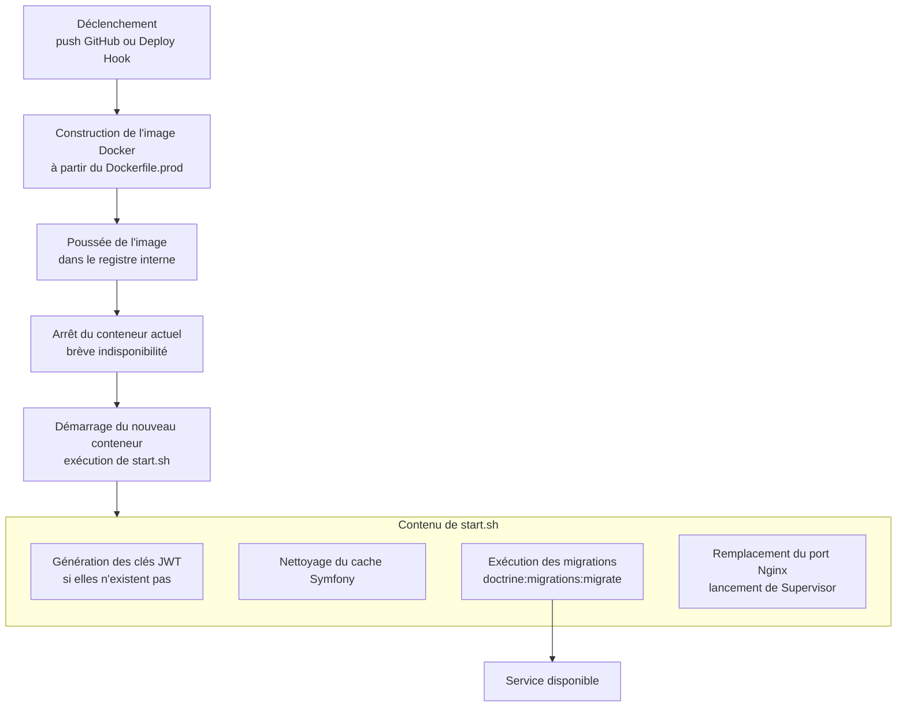

Le script `start.sh` est critique : c'est lui qui garantit que les
migrations de base de données sont appliquées **avant** que Nginx
commence à accepter des requêtes.

### Le cold start sur le plan gratuit

Le plan gratuit de Render met le service en veille après 15 minutes
d'inactivité. Le premier appel après cette période déclenche un
redémarrage qui prend environ 30 secondes. C'est le **cold start**.

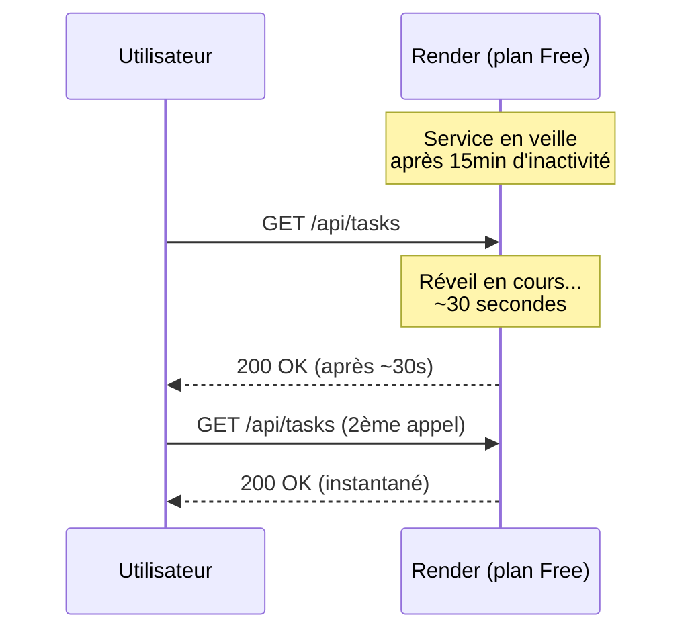

Pour les plans payants, le service reste actif en permanence.

---

## 8. Les services managés : base de données et cache

### PostgreSQL et Redis sur Render

Render propose des services de base de données gérés. "Managé"
signifie que Render s'occupe de l'installation, des mises à jour,
des sauvegardes et de la haute disponibilité. Vous n'avez pas à
administrer le serveur PostgreSQL lui-même.

Chaque service expose deux URL de connexion :

- **Internal URL** : connexion depuis un autre service Render dans
  la même région. Rapide, gratuite, sans passer par internet.
- **External URL** : connexion depuis l'extérieur (votre machine
  locale, un outil d'administration). Plus lente, utilisée
  ponctuellement.

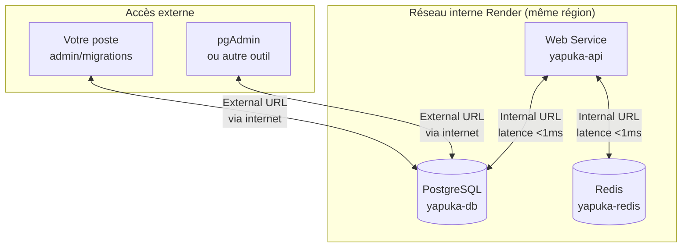

Redis est utilisé par Symfony pour stocker les sessions et le cache
de l'application, ce qui évite de charger la base de données pour
des données fréquemment accédées.

---

## 9. Ce que vous allez construire

Voici la vue d'ensemble complète de l'infrastructure que vous allez
mettre en place au cours de ce lab :

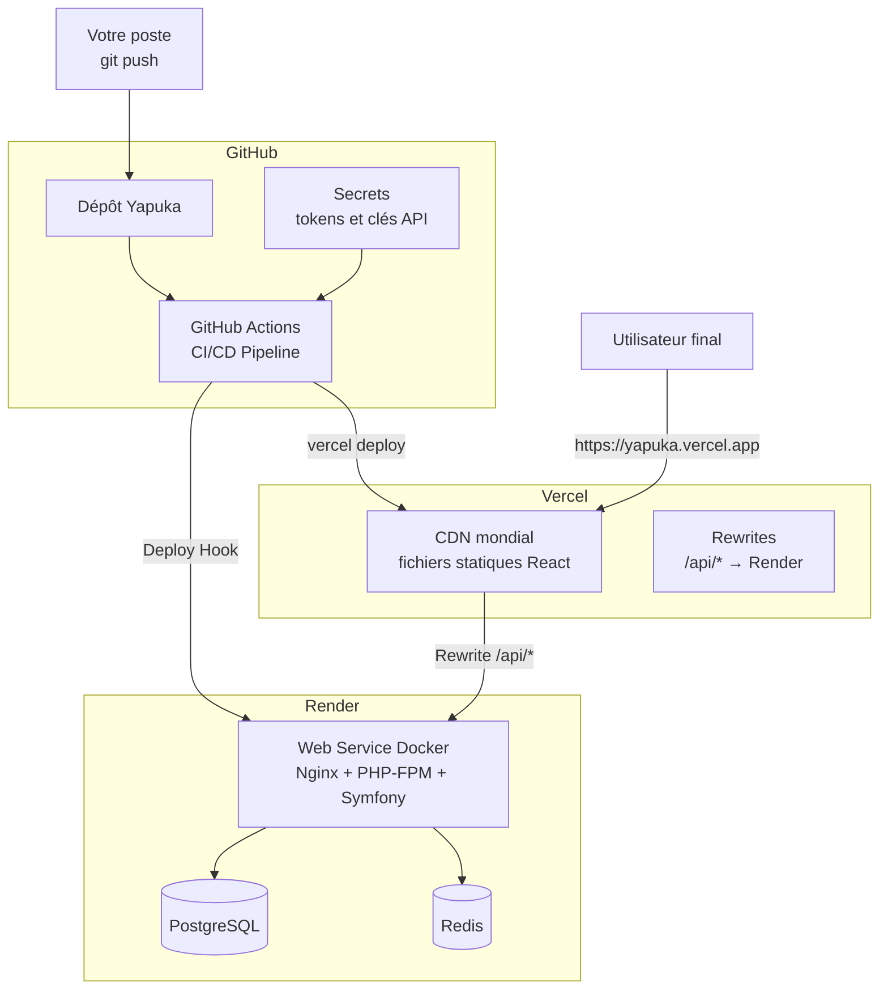

Vous repartirez de ce lab avec une application déployée, accessible
publiquement, et dont le déploiement s'automatise à chaque push sur
`main`.

---

## Récapitulatif des concepts clés

Avant de commencer le lab, assurez-vous d'avoir compris les points
suivants :

- **Docker multi-étapes** : construire une image légère et sécurisée
  pour la production en séparant la phase de build de l'image finale.

- **Supervisor** : lancer plusieurs processus (Nginx + PHP-FPM) dans
  un unique conteneur Docker.

- **Variables d'environnement** : séparer le code de la
  configuration ; ne jamais mettre de secrets dans le code source.

- **Rewrites Vercel** : rediriger transparently les appels `/api/*`
  du frontend vers le backend Render.

- **CORS** : configurer le backend pour autoriser explicitement les
  requêtes venant du domaine frontend.

- **Pipeline CI/CD** : tester automatiquement le code avant chaque
  déploiement, et ne déployer que si les tests passent.

- **Services managés Render** : utiliser les URLs internes pour
  connecter les services entre eux sans passer par internet.

- **Cold start** : limitation du plan gratuit Render — le service
  s'endort après 15 minutes d'inactivité.